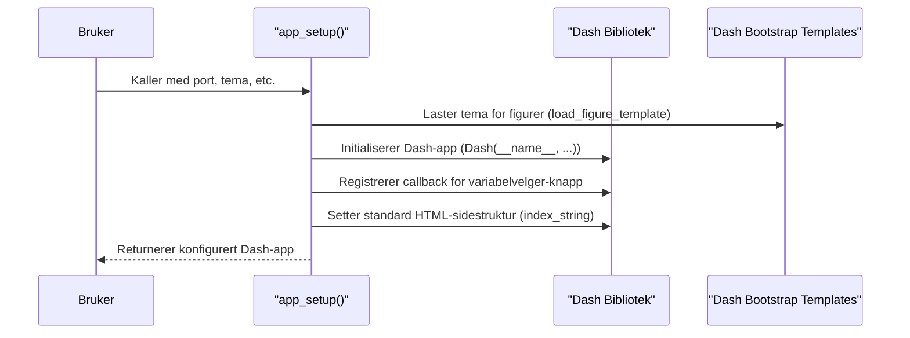
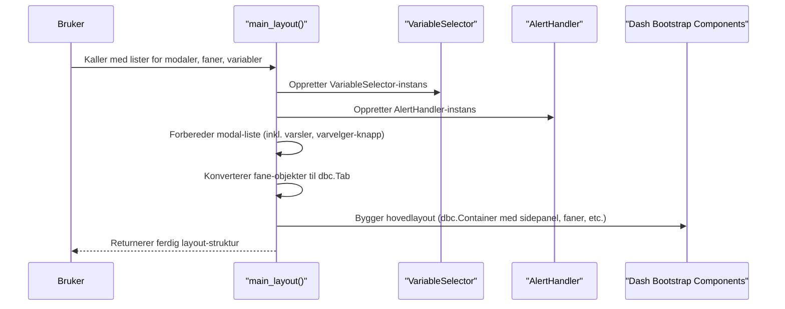

# Kapittel 1: AppSetup og MainLayout


Velkommen til det første kapittelet i vår veiledning for `ssb-dash-framework`! Dette rammeverket er designet for å gjøre det enklere å bygge interaktive webapplikasjoner med Dash, spesielt tilpasset behovene i SSB.

## Hva skal vi bygge? Fundamentet for din Dash-applikasjon

Har du noen gang ønsket å raskt sette opp en ny webapplikasjon, komplett med et pent tema, et standardisert oppsett med menyer og faner, uten å måtte skrive masse kode fra bunnen av hver gang? Det er akkurat det `AppSetup og MainLayout` hjelper deg med!

Tenk deg at du skal bygge et hus. Før du kan begynne å innrede rommene (som er funksjonaliteten i appen din), må du ha en solid grunnmur og en struktur for huset – vegger, tak, og en plan for hvor rommene skal være. I `ssb-dash-framework` er `AppSetup` grunnmuren, og `MainLayout` er selve husstrukturen. Sammen gir de deg et ferdig utgangspunkt slik at du kan fokusere på å fylle applikasjonen med innhold og funksjonalitet.

I dette kapittelet skal vi se på hvordan disse to kjernekomponentene, `AppSetup` og `MainLayout`, jobber sammen for å skape den grunnleggende rammen for din applikasjon.

## Nøkkelkonsepter: Grunnmur og Struktur

La oss bryte ned de to sentrale delene:

1.  **`AppSetup` (Grunnmuren):**
    *   **Hva det er:** `AppSetup` er en funksjon som initialiserer selve Dash-applikasjonen din. Den tar seg av de grunnleggende konfigurasjonene.
    *   **Analogi:** Tenk på `AppSetup` som å legge grunnmuren og sette opp de tekniske systemene for et nytt hus. Den sørger for at alt er klart for videre bygging.
    *   **Hva den gjør:**
        *   Starter en ny Dash-app.
        *   Setter et visuelt tema for applikasjonen (f.eks. "sketchy", "slate") ved hjelp av `dash-bootstrap-components`.
        *   Konfigurerer nødvendige stiler og URL-stier slik at appen fungerer korrekt, spesielt i SSB-miljøer.
        *   Setter opp en grunnleggende HTML-struktur for hele siden.

2.  **`MainLayout` (Husets Struktur):**
    *   **Hva det er:** `MainLayout` er en funksjon som definerer hvordan hovedelementene i brukergrensesnittet skal se ut og organiseres.
    *   **Analogi:** Hvis `AppSetup` var grunnmuren, er `MainLayout` som å reise veggene, taket, og definere de store rommene i huset. Den skaper den ytre rammen for alt innhold.
    *   **Hva den gjør:**
        *   Oppretter et **sidepanel**. Dette panelet inneholder vanligvis knapper for å åpne ulike [Faner og Vinduer (Modaler)](02_faner_og_vinduer__modaler__.md).
        *   Definerer et **faneområde** hvor innholdet fra de ulike fanene vises.
        *   Plasserer [Variabelvelgeren](03_variabelvelger_.md), et verktøy for å justere parametere som påvirker dataene eller visualiseringene i appen.
        *   Inkluderer en [Varslingshåndterer](06_varslingshåndterer_.md) for å vise meldinger til brukeren.

Sammen skaper `AppSetup` og `MainLayout` en standardisert og brukervennlig "beholder" for all funksjonaliteten du senere vil legge til.

## Hvordan bruke `AppSetup` og `MainLayout`

La oss se på et minimalt eksempel på hvordan du setter opp en grunnleggende applikasjon.

**Steg 1: Initialisere appen med `app_setup`**

Først må vi importere `app_setup` og kalle den med noen grunnleggende konfigurasjoner.

```python
# Importer nødvendige funksjoner
from ssb_dash_framework.setup import app_setup

# Konfigurer og initialiser appen
min_app = app_setup(
    port=8050,  # Portnummer appen skal kjøre på lokalt
    service_prefix="/min-forste-app/",  # Prefiks for URL-en til appen
    domain="localhost",  # Domenet appen kjører på
    stylesheet="sketchy"  # Velg et visuelt tema (f.eks. "slate", "cyborg")
)
# Nå er 'min_app' en Dash-applikasjon, klar for å få definert sin layout.
```
I koden over starter vi en ny Dash-applikasjon. `stylesheet="sketchy"` gir appen et håndtegnet utseende. Du kan eksperimentere med andre temaer som "slate" eller "superhero" for et mørkere preg. `service_prefix` er viktig for hvordan appens URL blir seende ut, spesielt når den kjøres i produksjonsmiljøer.

**Steg 2: Definere hovedlayouten med `main_layout`**

Når appen er initialisert, trenger vi å definere hvordan den skal se ut. Dette gjøres med `main_layout`. `main_layout` trenger informasjon om hvilke modaler (vinduer), faner og variabler som skal være tilgjengelige. Foreløpig lager vi tomme lister eller enkle plassholdere for disse. Vi kommer tilbake til hvordan du lager faktiske [Faner og Vinduer (Modaler)](02_faner_og_vinduer__modaler__.md) og [Variabelvelger](03_variabelvelger_.md) i senere kapitler.

```python
# Importer nødvendige funksjoner og komponenter
from ssb_dash_framework.setup import main_layout
from dash import html # For å lage enkle HTML-elementer
import dash_bootstrap_components as dbc # For Bootstrap-komponenter

# Forbered dummy-innhold (mer om dette i senere kapitler)
# Foreløpig tomme lister eller enkle plassholdere
dummy_modal_liste = [
    html.Div(dbc.Button("Åpne Vindu 1", id="knapp-modal-1"))
]

# En veldig enkel representasjon av en fane-struktur
class MinForsteFane:
    def layout(self):
        return html.Div("Dette er innholdet i min første fane!")
    def label(self):
        return "Fane 1"

dummy_fane_liste = [MinForsteFane()]
dummy_variabel_liste = ["år", "region"] # Navn på variabler for Variabelvelgeren

# Generer hovedlayouten
app_layout_struktur = main_layout(
    modal_list=dummy_modal_liste,
    tab_list=dummy_fane_liste,
    variable_list=dummy_variabel_liste
)

# Fortell Dash-appen ('min_app') at den skal bruke denne layout-strukturen
min_app.layout = app_layout_struktur

# For å kjøre appen (legg til på slutten av skriptet ditt):
# if __name__ == "__main__":
#     min_app.run_server(debug=True)
```
I dette eksempelet gir vi `main_layout` en liste med en enkel knapp som senere kan kobles til et modalvindu, en veldig enkel fane, og en liste med navn på variabler som [Variabelvelgeren](03_variabelvelger_.md) kan bruke. `main_layout` vil da organisere disse elementene i en standardisert struktur med et sidepanel for knapper, et hovedområde for faner, og en plass for variabelvelgeren.

Når du kjører dette (ved å fjerne kommentarene rundt `min_app.run_server`), vil du se en enkel applikasjon med "sketchy"-tema, en knapp i sidepanelet, en fane merket "Fane 1", og en knapp for å vise/skjule variabelvelgeren.

## Under panseret: Hvordan fungerer det?

La oss se litt nærmere på hva som skjer når du kaller `app_setup` og `main_layout`.

### `app_setup` – Grunnarbeidet

Når du kaller `app_setup(port=..., stylesheet=...)`:

1.  **Velger Tema:** Funksjonen slår opp det valgte `stylesheet`-navnet (f.eks. "sketchy") i en intern liste (`theme_map`) for å finne den faktiske lenken til stilarket fra `dash-bootstrap-components`.
2.  **Laster Figursjablong:** Den laster også en mal (`load_figure_template`) som sørger for at grafer og figurer du lager senere vil matche appens tema.
3.  **Initialiserer Dash:** En ny Dash-applikasjon (`app = Dash(...)`) blir opprettet. Viktige parametere som `requests_pathname_prefix` (for korrekt URL-håndtering) og `external_stylesheets` (for å inkludere temaet) settes her.
4.  **HTML Skjelett:** En standard HTML-sidestruktur (`app.index_string`) defineres. Denne sørger for at appen fyller hele nettleservinduet og har de nødvendige meta-taggene.
5.  **Callback for Variabelvelger:** En intern [callback](httpses://dash.plotly.com/basic-callbacks) settes opp. Denne gjør at knappen for å vise/skjule [Variabelvelgeren](03_variabelvelger_.md) fungerer. (Mer om callbacks senere!)
6.  **Returnerer Appen:** Den konfigurerte Dash-app-objektet returneres, klart til bruk.

Her er en forenklet visualisering av prosessen:



Et lite utdrag fra `src/ssb_dash_framework/setup/app_setup.py` som viser tema-oppslaget og Dash-initialiseringen:

```python
# src/ssb_dash_framework/setup/app_setup.py
# ... (andre importer) ...
theme_map = {  # Kartlegger temanavn til faktiske temaer
    "sketchy": dbc.themes.SKETCHY,
    "slate": dbc.themes.SLATE,
    # ... flere temaer ...
}

def app_setup(port: int, ..., stylesheet: str) -> Dash:
    template = theme_map[stylesheet] # Henter riktig tema basert på navnet
    load_figure_template([template]) # Laster tema for Plotly-figurer

    app = Dash( # Initialiserer selve Dash-applikasjonen
        __name__,
        requests_pathname_prefix=f"{service_prefix}proxy/{port}/",
        external_stylesheets=[theme_map[stylesheet], dbc_css], # Legger til temaet
    )
    # ... (definisjon av callback og index_string) ...
    return app
```
Dette viser hvordan `app_setup` bruker input `stylesheet` til å velge riktig tema og konfigurerer Dash-applikasjonen med dette temaet og andre viktige innstillinger.

### `main_layout` – Bygging av Strukturen

Når du kaller `main_layout(modal_list=..., tab_list=..., variable_list=...)`:

1.  **Oppretter [Variabelvelger](03_variabelvelger_.md):** En instans av `VariableSelector` blir laget basert på `variable_list` du sender inn. Denne komponenten vil vises i et "offcanvas"-panel (et panel som sklir inn fra siden).
2.  **Legger til [Varslingshåndterer](06_varslingshåndterer_.md):** En `AlertHandler` blir initialisert. Denne er ansvarlig for å vise varsler og feilmeldinger på en pen måte. Layouten for denne blir lagt til i listen over modaler.
3.  **Forbereder Modaler og Knapper:** Listen `modal_list` (som inneholder dine definerte modaler/vinduer) blir satt sammen med varslingshåndtereren. En knapp for å vise/skjule [Variabelvelgeren](03_variabelvelger_.md) blir også lagt til her, og disse plasseres i sidepanelet.
4.  **Bygger Faner:** Hvert element i `tab_list` (som representerer dine [Faner og Vinduer (Modaler)](02_faner_og_vinduer__modaler__.md)) blir omgjort til et `dbc.Tab`-objekt. Hver fane må ha en `layout()`-metode som returnerer innholdet, og en `label`-attributt for fanens navn.
5.  **Sammensetter Hovedstrukturen:** Alle disse delene settes sammen i en `dbc.Container`. Denne containeren bruker et grid-system for å definere et smalt sidepanel (ca. 5% av bredden) og et stort hovedområde (ca. 95% av bredden).
    *   Sidepanelet inneholder knappene for modalene og variabelvelger-knappen.
    *   Hovedområdet inneholder `Offcanvas`-komponenten for [Variabelvelgeren](03_variabelvelger_.md) og faneområdet (`dbc.Tabs`).
6.  **Returnerer Layout:** Den ferdigbygde layout-containeren returneres. Denne kan du så tildele til `app.layout`.

Her er en forenklet visualisering av prosessen:


Et lite utdrag fra `src/ssb_dash_framework/setup/main_layout.py` som viser hvordan strukturen settes sammen:
```python
# src/ssb_dash_framework/setup/main_layout.py
# ... (importer) ...
def main_layout(
    modal_list: list[html.Div],
    tab_list: list[html.Div],
    variable_list: list[str],
    # ...
) -> dbc.Container:
    variable_selector = VariableSelector( # Intern opprettelse av Variabelvelger
        selected_states=variable_list, # ...
    )
    alerthandler = AlertHandler() # Intern opprettelse av Varslingshåndterer
    # ... (logikk for å legge til alerthandler og varvelger-knapp i modal_list) ...

    # Konverterer dine fane-objekter til faktiske Dash Bootstrap Tabs
    selected_tab_list = [dbc.Tab(tab.layout(), label=tab.label) for tab in tab_list]

    layout = dbc.Container( # Hovedbeholderen for hele appen
        [
            # ... (plass for varsler, etc.) ...
            html.Div( # Selve layout-gridet
                id="main-layout",
                style={"display": "grid", "grid-template-columns": "5% 95%"},
                children=[
                    html.Div(children=modal_list, className="bg-secondary"), # Sidepanel
                    html.Div( # Hovedinnholdsområde
                        children=[
                            dbc.Offcanvas( # Variabelvelgeren (skjult i starten)
                                children=variable_selector.layout(), # ...
                            ),
                            html.Div(dbc.Tabs(selected_tab_list)), # Faneområdet
                        ]
                    ),
                ],
            ),
        ],
        fluid=True # Gjør at containeren fyller bredden
    )
    return layout
```
Denne koden viser hvordan `main_layout` tar listene du sender inn, kombinerer dem med interne komponenter som `VariableSelector` og `AlertHandler`, og strukturerer dem inn i et sidepanel og et hovedområde med faner ved hjelp av `dbc.Container` og `dbc.Tabs`.

## Oppsummering

I dette kapittelet har vi lagt fundamentet! Du har lært:

*   At `AppSetup` er som å legge grunnmuren for applikasjonen din: den initialiserer Dash, setter tema og grunnleggende konfigurasjoner.
*   At `MainLayout` er som å reise veggene og taket: den definerer hovedstrukturen med sidepanel, faneområde og plass for variabelvelgeren.
*   Hvordan du bruker `app_setup` for å starte appen og `main_layout` for å definere dens utseende med enkle lister som input.
*   Litt om hva som skjer "under panseret" når disse funksjonene kalles.

Med `AppSetup` og `MainLayout` får du en solid start på Dash-prosjektet ditt, med en profesjonell og gjenkjennelig struktur.

Nå som vi har en grunnleggende applikasjonsramme på plass, er neste steg å fylle den med innhold. I neste kapittel, [Faner og Vinduer (Modaler)](02_faner_og_vinduer__modaler__.md), skal vi se nærmere på hvordan du kan lage og administrere ulike "rom" eller seksjoner i applikasjonen din ved hjelp av faner og modalvinduer.

---

Generated by [AI Codebase Knowledge Builder](https://github.com/The-Pocket/Tutorial-Codebase-Knowledge)
