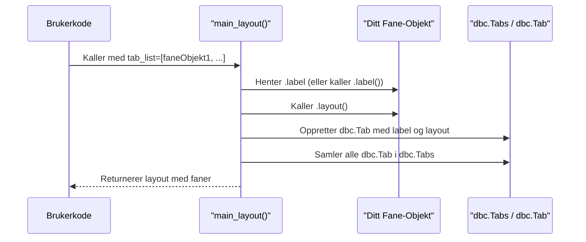
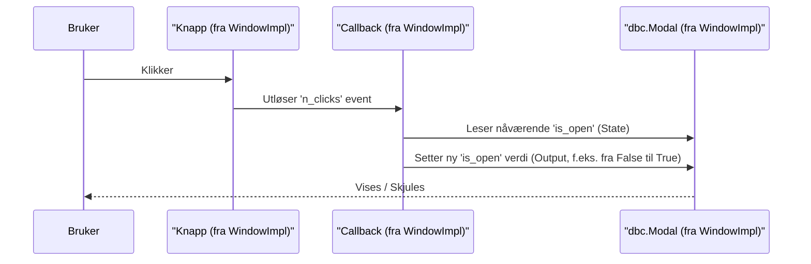

# Chapter 2: Faner og Vinduer (Modaler)


I forrige kapittel, [Applikasjonsoppsett og Hovedlayout](01_applikasjonsoppsett_og_hovedlayout_.md), la vi grunnlaget for applikasjonen vår. Vi så hvordan `AppSetup` initialiserer selve appen og setter tema, mens `MainLayout` bygger den overordnede strukturen med et sidepanel og et hovedområde. Nå skal vi se på hvordan vi kan fylle dette hovedområdet med innhold og funksjonalitet ved hjelp av faner, og hvordan vi kan bruke vinduer (modaler) for mer fokuserte oppgaver.

## Hvorfor trenger vi faner og vinduer?

Forestill deg at du bygger en applikasjon for å analysere statistikk. Du vil kanskje ha:
1.  Én del av appen som viser data i tabeller.
2.  En annen del som viser de samme dataene i grafer.
3.  En spesiell funksjon for å laste opp nye data, som du ikke vil skal ta opp plass hele tiden.

Hvordan organiserer du dette på en ryddig måte? Det er her faner og vinduer kommer inn!

*   **Faner** lar deg bytte mellom ulike hovedseksjoner (som tabellvisning og grafvisning). Det er som å ha flere ark i en perm.
*   **Vinduer (eller Modaler)** er som pop-up-bokser som dukker opp over hovedinnholdet. De er perfekte for midlertidige oppgaver (som datainnlasting) eller for å vise detaljert informasjon uten å måtte bytte "ark" helt.

I `ssb-dash-framework` er disse to de primære måtene moduler (som er selvstendige deler av funksjonalitet, mer om det i [Modul](04_modul_.md)) presenteres for brukeren.

## Nøkkelkonsepter: Organisere innholdet ditt

La oss se nærmere på disse to konseptene.

### 1. Faner: Hovedseksjonene i appen din

En **fane** (engelsk: Tab) er akkurat som en fane i nettleseren din eller en skilleark i en fysisk perm. Den lar brukeren enkelt bytte mellom forskjellige hovedvisninger eller verktøysett i applikasjonen.

*   **Analogi:** Tenk på fanene i en ringperm. Hver fane leder deg til en ny seksjon med relatert innhold.
*   **Hva den gjør:** Organiserer større deler av applikasjonens innhold eller funksjonalitet i separate, byttbare visninger.
*   **Hvordan det ser ut:** Fanene vises typisk øverst i hovedinnholdsområdet, og når du klikker på en fane, endres innholdet under.

I `ssb-dash-framework` må et objekt som skal fungere som en fane, ha to viktige ting:
1.  En `label()`-metode (eller et `label`-attributt) som returnerer teksten som skal vises på selve faneknappen.
2.  En `layout()`-metode som returnerer Dash-komponentene (innholdet) som skal vises når fanen er aktiv.

### 2. Vinduer (Modaler): Fokuserte oppgaver og informasjon

Et **vindu** (ofte kalt **Modal** eller pop-up) er en boks som dukker opp *over* det nåværende hovedinnholdet. Dette er nyttig for:
*   Å vise spesifikk informasjon (f.eks. detaljer om et valgt element).
*   Å utføre en dedikert oppgave (f.eks. et innstillingsskjema, en filopplasting).
*   Å presentere et lite verktøy uten at brukeren må forlate den nåværende hovedvisningen.

*   **Analogi:** Tenk på en dialogboks som spør "Er du sikker på at du vil slette dette?" eller et lite informasjonsvindu som dukker opp når du klikker på et hjelpeikon.
*   **Hva den gjør:** Gir en måte å presentere informasjon eller interaksjon på en fokusert måte, uten å navigere bort fra den gjeldende siden.
*   **Hvordan det ser ut:** En boks som legger seg over resten av appen, ofte med en litt nedtonet bakgrunn for å fremheve vinduet. Man må vanligvis lukke vinduet for å interagere med resten av appen igjen.
*   **Aktivering:** Vinduer aktiveres ofte via knapper, gjerne plassert i sidepanelet som ble satt opp av `MainLayout` (se [Applikasjonsoppsett og Hovedlayout](01_applikasjonsoppsett_og_hovedlayout_.md)).

Rammeverket tilbyr en hjelpeklasse kalt `WindowImplementation` som gjør det mye enklere å lage moduler som vises i slike vinduer. Denne klassen tar seg av mye av koden for å vise/skjule vinduet og lage knappen som åpner det.

## Hvordan bruke Faner og Vinduer

La oss se hvordan du kan implementere en enkel fane og et enkelt vindu i applikasjonen din. Husk fra forrige kapittel at `main_layout`-funksjonen tar imot en `tab_list` og en `modal_list`.

### Lage en Fane

For å lage en fane, trenger du en klasse som har en `label`-egenskap (eller metode) og en `layout`-metode.

**Steg 1: Definere fane-klassen**

```python
# Importer html-komponenter fra Dash
from dash import html

class MinDataFane:
    # Egenskap for fanens navn
    label = "Mine Data"

    def layout(self):
        # Innholdet som skal vises i denne fanen
        return html.Div([
            html.H3("Velkommen til Mine Data!"),
            html.P("Her kan du se dine fantastiske data.")
            # Her ville du vanligvis lagt til tabeller, grafer, etc.
        ])

# Du kan også bruke en __init__ for å gjøre navnet mer dynamisk:
class EnAnnenFane:
    def __init__(self, tittel: str):
        self._tittel = tittel # Lagre tittelen internt

    def label(self) -> str:
        return self._tittel # Returner tittelen som etikett

    def layout(self):
        return html.Div(f"Innhold for {self._tittel}")
```
I eksempelet over definerer `MinDataFane` en fast `label` ("Mine Data") og en `layout`-metode som returnerer noen enkle HTML-elementer. `EnAnnenFane` viser hvordan du kan sette tittelen når du lager et objekt av klassen.

`ssb-dash-framework` tilbyr også ferdiglagde faner, som for eksempel `EditingTableTab` for å vise redigerbare tabeller. Denne arver fra `EditingTable` (en type [Modul](04_modul_.md)) og har allerede `label` og `layout` definert.

**Steg 2: Legge til fanen i `main_layout`**

Når du har fane-objektene dine, sender du dem inn som en liste til `main_layout` (som vi så i [Applikasjonsoppsett og Hovedlayout](01_applikasjonsoppsett_og_hovedlayout_.md)).

```python
# Anta at min_app er initialisert med app_setup
# fra ssb_dash_framework.setup import main_layout (som i kapittel 1)

# Lag instanser av fanene våre
fane1 = MinDataFane()
fane2 = EnAnnenFane("Analysefane")

# Lag en liste med fane-objekter
fane_liste = [fane1, fane2]

# Generer hovedlayouten (modal_list og variable_list er foreløpig tomme)
app_layout_struktur = main_layout(
    modal_list=[],  # Vi kommer til modaler snart
    tab_list=fane_liste,
    variable_list=[] # Mer om dette i kapittel om Variabelvelger
)

min_app.layout = app_layout_struktur
```
Nå vil applikasjonen din ha to faner: "Mine Data" og "Analysefane". Når du klikker på dem, vil innholdet definert i deres respektive `layout`-metoder vises.

### Lage et Vindu (Modal) med `WindowImplementation`

For å lage et vindu, er den enkleste måten å lage en klasse som arver fra `WindowImplementation`. Denne hjelpeklassen tar seg av mye av det tekniske.

**Steg 1: Definere vindu-klassen**

Klassen din må definere tre ting:
1.  `label`: Teksten for knappen i sidepanelet og tittelen på vinduet.
2.  `module_name`: Et unikt navn for modulen (brukes internt for ID-er).
3.  `module_layout`: Innholdet som skal vises inne i modalvinduet.

```python
from dash import html
import dash_bootstrap_components as dbc
# Importer WindowImplementation (banen kan variere basert på installasjon)
from ssb_dash_framework.utils import WindowImplementation

class MittVerktoyVindu(WindowImplementation):
    def __init__(self):
        # Definer nødvendige attributter for WindowImplementation
        self.label = "Åpne Verktøy"
        self.module_name = "mitt_verktoy" # Må være unik
        self.module_layout = html.Div([
            html.P("Dette er mitt spesialverktøy!"),
            dbc.Button("Gjør noe", color="primary")
        ])
        # Viktig: Kall __init__ til superklassen (WindowImplementation)
        super().__init__()

# Lag en instans av vinduet ditt
mitt_vindu_objekt = MittVerktoyVindu()
```
Her lager vi `MittVerktoyVindu`. `WindowImplementation` vil automatisk:
*   Lage en knapp med teksten "Åpne Verktøy" som kan plasseres i sidepanelet.
*   Lage et modalvindu med tittelen "Åpne Verktøy".
*   Sørge for at knappen åpner og lukker vinduet.
*   Plassere innholdet fra `self.module_layout` inne i vinduet.

**Steg 2: Legge til vinduet i `main_layout`**

`WindowImplementation` har en egen `layout()`-metode. Denne metoden returnerer *både* knappen for sidepanelet *og* selve modalvinduet (som er skjult i starten). Du legger resultatet av `mitt_vindu_objekt.layout()` til i `modal_list`.

```python
# Anta at min_app og fane_liste er definert som tidligere
# fra ssb_dash_framework.setup import main_layout (som i kapittel 1)

# Lag en liste for modaler/vinduer
# mitt_vindu_objekt.layout() returnerer Dash-komponenter for knappen og modalen
modal_liste_for_layout = [mitt_vindu_objekt.layout()]

# Generer hovedlayouten
app_layout_struktur = main_layout(
    modal_list=modal_liste_for_layout,
    tab_list=fane_liste, # Fra forrige eksempel
    variable_list=[]
)

min_app.layout = app_layout_struktur
```
Nå vil applikasjonen din ha en knapp i sidepanelet med teksten "Åpne Verktøy". Når du klikker på den, vil et modalvindu dukke opp med innholdet du definerte.

## Under panseret: Hvordan fungerer det?

La oss kikke litt på hva som skjer bak kulissene.

### Hvordan Faner blir til

Når du sender `tab_list` til `main_layout`:
1.  `main_layout` går gjennom hvert objekt i listen din.
2.  For hvert objekt (f.eks. `fane1` fra eksempelet vårt), henter den `fane1.label` (eller kaller `fane1.label()` hvis det er en metode) for å få navnet på fanen.
3.  Den kaller `fane1.layout()` for å få Dash-komponentene som utgjør innholdet i fanen.
4.  Disse blir så satt sammen til `dbc.Tab`-komponenter og plassert inne i en `dbc.Tabs`-komponent fra `dash-bootstrap-components`. Dette er det som faktisk tegner fanene på skjermen.

En forenklet flyt:


Du kan se et hint av dette i kildekoden til `ssb_dash_framework` (forenklet):
```python
# Fra src/ssb_dash_framework/setup/main_layout.py (prinsippskisse)
# import dash_bootstrap_components as dbc

def main_layout(tab_list: list, ...):
    # ... annen kode ...
    selected_tab_list = []
    for tab_objekt in tab_list:
        # Antar at tab_objekt har .label og .layout()
        fane_innhold = tab_objekt.layout()
        fane_navn = tab_objekt.label # Eller tab_objekt.label()
        selected_tab_list.append(dbc.Tab(fane_innhold, label=fane_navn))

    fane_omraade = dbc.Tabs(selected_tab_list)
    # ... setter sammen resten av layouten ...
    return layout_container
```
Denne koden viser hvordan `main_layout` itererer gjennom dine faneobjekter og bruker `dbc.Tab` for å lage hver enkelt fane.

### Hvordan Vinduer (Modaler) med `WindowImplementation` fungerer

`WindowImplementation` er en smart hjelpeklasse (en "mixin"). Når klassen din, f.eks. `MittVerktoyVindu`, arver fra den og kaller `super().__init__()`:

1.  **Initialisering (`__init__`):**
    *   `WindowImplementation` genererer unike ID-er for modalvinduet og knappen, basert på `self.module_name` og et internt tellerverk (`_window_number`). Dette sikrer at flere vinduer ikke kommer i konflikt med hverandre.
    *   Den kaller `self.window_callbacks()` for å sette opp logikken som åpner/lukker vinduet.

2.  **Layoutgenerering (`layout()`):**
    *   Når du kaller `mitt_vindu_objekt.layout()`, lager `WindowImplementation` to hovedting:
        *   En `dbc.Modal`: Dette er selve pop-up-vinduet. Det får tittelen fra `self.label` og innholdet fra `self.get_module_layout()` (som standard henter `self.module_layout` du definerte).
        *   En knapp (ved hjelp av en intern funksjon `sidebar_button`): Denne knappen får også tekst fra `self.label`.
    *   Disse to (knappen og modalvinduet) returneres samlet, klare til å plasseres i `main_layout` sin `modal_list`.

3.  **Callbacks (`window_callbacks()`):**
    *   Dette er hjertet i funksjonaliteten. `WindowImplementation` definerer en Dash [callback](https://dash.plotly.com/basic-callbacks) (mer om callbacks senere i Dash-verdenen, men tenk på det som en regel som sier "når X skjer, gjør Y").
    *   **Input:** Klikk på sidepanel-knappen (identifisert med den unike ID-en).
    *   **Output:** `is_open`-egenskapen til `dbc.Modal`-komponenten (som også har en unik ID). Denne egenskapen styrer om modalen er synlig eller ikke.
    *   **State:** Den nåværende `is_open`-statusen til modalen.
    *   **Funksjon:** Når knappen klikkes, sjekker callbacken om modalen er åpen. Hvis den er åpen, lukkes den. Hvis den er lukket, åpnes den.

Her er en forenklet flyt for når brukeren klikker på knappen for å åpne/lukke et vindu laget med `WindowImplementation`:


Et lite utdrag fra `src/ssb_dash_framework/utils/implementations.py` (`WindowImplementation`):
```python
# src/ssb_dash_framework/utils/implementations.py (forenklet)
# import dash_bootstrap_components as dbc
# from dash import callback, html, Input, Output, State

class WindowImplementation:
    # ... __init__ setter opp self._window_n, self.module_name, self.label ...

    def layout(self) -> html.Div:
        # Lager selve modal-vinduet
        modal = dbc.Modal(
            [
                dbc.ModalHeader(dbc.ModalTitle(self.label)),
                dbc.ModalBody(self.get_module_layout()), # Henter ditt innhold
            ],
            id=f"{self._window_n}-{self.module_name}-modal", # Unik ID
            # ... andre modal-innstillinger ...
        )
        # Lager knappen for sidepanelet
        knapp = sidebar_button( # Intern hjelpefunksjon
            "🔍", # Ikon
            f"{self.label}",
            f"sidebar-{self._window_n}-{self.module_name}-modal-button", # Unik ID
        )
        return html.Div([modal, knapp]) # Returnerer begge

    def window_callbacks(self) -> None:
        @callback(
            Output(f"{self._window_n}-{self.module_name}-modal", "is_open"),
            Input(f"sidebar-{self._window_n}-{self.module_name}-modal-button", "n_clicks"),
            State(f"{self._window_n}-{self.module_name}-modal", "is_open"),
        )
        def _modal_toggle(n_clicks: int, is_open: bool) -> bool:
            if n_clicks: # Hvis knappen er klikket
                return not is_open # Snu synligheten
            return is_open # Ellers, behold nåværende tilstand
```
Dette viser hvordan `WindowImplementation` setter opp både det visuelle (modal og knapp) og logikken (callback) for å få vinduet til å fungere med minimal innsats fra deg.

## Oppsummering

I dette kapittelet har du lært:
*   Hva **faner** er og hvordan de brukes for å bytte mellom hovedseksjoner i applikasjonen din.
*   Hva **vinduer (modaler)** er og hvordan de brukes for fokuserte oppgaver eller informasjon uten å forlate hovedvisningen.
*   Hvordan du lager enkle fane-objekter ved å definere en `label` og en `layout()`-metode, og hvordan du legger dem til i `main_layout`.
*   Hvordan du enkelt kan lage moduler som vises i vinduer ved å arve fra `WindowImplementation`, definere `label`, `module_name` og `module_layout`, og deretter legge resultatet av `din_klasse.layout()` til i `modal_list`.
*   Litt om hvordan `main_layout` bruker `dbc.Tabs` for å vise faner, og hvordan `WindowImplementation` bruker `dbc.Modal` og Dash callbacks for å håndtere vinduer.

Med faner og vinduer har du nå kraftige verktøy for å organisere og presentere funksjonaliteten i din `ssb-dash-framework`-applikasjon på en brukervennlig måte!

I neste kapittel, [Variabelvelger](03_variabelvelger_.md), skal vi se på en spesiell komponent som ofte brukes sammen med faner og moduler for å la brukeren justere parametere og filtrere data.

---

Generated by [AI Codebase Knowledge Builder](https://github.com/The-Pocket/Tutorial-Codebase-Knowledge)