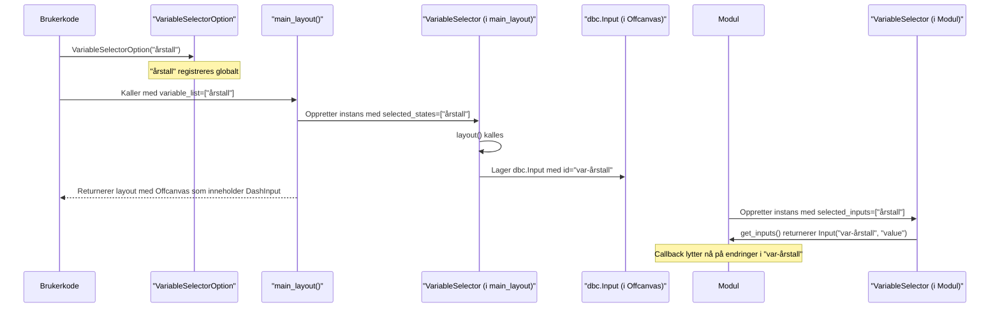

# Kapittel 3: Variabelvelger


I forrige kapittel, [Faner og Vinduer (Modaler)](02_faner_og_vinduer__modaler__.md), lærte vi hvordan vi kan organisere applikasjonen vår i ulike seksjoner ved hjelp av faner og hvordan vi kan bruke modalvinduer for fokuserte oppgaver. Nå skal vi se på en sentral komponent som lar brukeren styre felles data eller innstillinger som påvirker flere deler av applikasjonen: **Variabelvelgeren**.

## Hvorfor trenger vi en Variabelvelger?

Forestill deg at du bygger en dashboard-applikasjon som viser statistikk. Du har kanskje:
*   En fane med en tabell som viser befolkningstall.
*   En annen fane med et diagram som viser den samme befolkningsstatistikken grafisk.
*   Kanskje et modalvindu som gir detaljert informasjon om en spesifikk aldersgruppe.

Alle disse delene av applikasjonen trenger å vite *hvilket årstall* og *hvilken region* brukeren er interessert i. Uten en felles mekanisme, måtte hver fane og hvert vindu hatt sine egne input-felt for år og region. Dette ville vært tungvint for brukeren (måtte skrive inn det samme flere steder) og komplisert for deg som utvikler (hvordan holder du disse synkronisert?).

**Variabelvelgeren** løser dette problemet! Den fungerer som et sentralt kontrollpanel der brukeren kan velge felles verdier, som årstall eller region. Disse valgene blir så tilgjengelige for alle deler av applikasjonen (faner, moduler, vinduer). Dette sikrer at alle deler av applikasjonen "snakker om" det samme datagrunnlaget.

## Nøkkelkonsepter: Ditt sentrale kontrollpanel

La oss bryte ned hvordan Variabelvelgeren fungerer:

1.  **`VariableSelectorOption` (Definere en variabel):**
    *   **Hva det er:** Før du kan velge en variabel (som "årstall"), må den defineres. `VariableSelectorOption` er en måte å fortelle rammeverket at "årstall" er en gyldig variabel som kan brukes i Variabelvelgeren.
    *   **Analogi:** Tenk på det som å legge til en ny type innstilling i kontrollpanelet, f.eks. "Volum" eller "Lysstyrke". Du definerer navnet og typen (f.eks. tekst, tall).
    *   **Hvordan det fungerer:** Du lager en instans av `VariableSelectorOption` med et unikt navn (f.eks. "årstall"). Dette gjør variabelen tilgjengelig for bruk i hele applikasjonen.

2.  **`VariableSelector` (Gruppere og bruke variabler):**
    *   **Hva det er:** `VariableSelector` er selve "motoren". Den tar en liste med *navn* på definerte `VariableSelectorOption`-er og lager brukergrensesnittet (input-felt) for disse i Variabelvelger-panelet.
    *   **Analogi:** `VariableSelector` er selve kontrollpanelet som viser de valgte innstillingene (f.eks. volumslideren, lysstyrkeknappen). Hver del av appen din (f.eks. en fane) kan ha sin egen "kopi" av `VariableSelector` for å spesifisere *hvilke* av de globale variablene den bryr seg om, og hvordan den skal reagere på endringer.
    *   **Hvordan det fungerer:**
        *   `main_layout` bruker en `VariableSelector` for å *vise* de valgte variablene i et sidepanel (Offcanvas).
        *   Hver [Modul](04_modul_.md) (f.eks. en fane som viser data) kan opprette sin egen `VariableSelector`-instans for å *hente ut* verdiene fra de globale variablene eller til og med *oppdatere* dem.

3.  **Deling av verdier:**
    *   Når en bruker endrer en verdi i Variabelvelger-panelet (f.eks. velger et nytt årstall), blir denne nye verdien lagret sentralt.
    *   Andre deler av applikasjonen som "abonnerer" på denne variabelen (via sin egen `VariableSelector`-instans) kan da automatisk oppdateres for å reflektere det nye valget.

## Hvordan bruke Variabelvelgeren

La oss se på hvordan vi kan sette opp og bruke Variabelvelgeren.

### Steg 1: Definere hvilke variabler som skal være tilgjengelige globalt (`VariableSelectorOption`)

Først må vi definere hvilke "globale" variabler som skal kunne velges. Dette gjøres ved å opprette instanser av `VariableSelectorOption`. Dette gjøres vanligvis én gang, gjerne tidlig i applikasjonskoden din.

```python
# Importer VariableSelectorOption
from ssb_dash_framework.setup import VariableSelectorOption

# Definer de globale variablene vi ønsker å bruke
# Dette gjør "årstall" og "region" tilgjengelige for Variabelvelgeren
VariableSelectorOption(variable_title="årstall")
VariableSelectorOption(variable_title="region")
# Du kan også spesifisere type, men "text" er standard
# VariableSelectorOption(variable_title="antall_brukere", variable_type="number")
```
I koden over har vi definert to variabler: "årstall" og "region". Navnet du gir til `variable_title` er viktig, da det er dette navnet du vil bruke senere for å referere til variabelen. Hver `VariableSelectorOption` får automatisk en intern ID, typisk `var-<variable_title>`.

### Steg 2: Gjøre Variabelvelgeren synlig i applikasjonen (`main_layout`)

Nå som variablene er definert, må vi fortelle `main_layout` at vi vil ha en Variabelvelger som viser dem. Dette gjøres ved å sende en liste med variabelnavn til `variable_list`-parameteren i `main_layout`. Du kan også sette standardverdier.

```python
# Anta at min_app, fane_liste og modal_liste er definert som i tidligere kapitler
# fra ssb_dash_framework.setup import main_layout

# Liste over navn på variabler som skal vises i Variabelvelgeren
mine_valgte_variabler = ["årstall", "region"]

# Valgfrie standardverdier
start_verdier = {
    "årstall": "2023",
    "region": "Oslo"
}

app_layout_struktur = main_layout(
    modal_list=modal_liste, # Fra kapittel 2
    tab_list=fane_liste,    # Fra kapittel 2
    variable_list=mine_valgte_variabler,
    default_values=start_verdier
)
min_app.layout = app_layout_struktur
```
Når du kjører appen nå, vil du se en knapp i sidepanelet (merket "🛆"). Klikker du på denne, åpnes et panel (en `Offcanvas`) fra høyre side. Inne i dette panelet vil du se input-felt for "årstall" (med "2023" fylt ut) og "region" (med "Oslo" fylt ut). Disse er nå klare til å bli brukt av resten av applikasjonen!

### Steg 3: Få tilgang til og bruke valgte verdier (i en [Modul](04_modul_.md))

Hvordan kan en fane eller et vindu (som vi kaller [Modul](04_modul_.md)er) få tak i verdiene brukeren velger? Hver modul som trenger tilgang til disse delte variablene, oppretter sin egen instans av `VariableSelector`. Denne instansen forteller hvilke av de globale variablene modulen er interessert i, og om den skal reagere automatisk når de endres (`selected_inputs`) eller bare lese dem ved behov (`selected_states`).

La oss se på et forenklet eksempel på hvordan en modul kan bruke dette. Fullstendig bruk i moduler dekkes i neste kapittel.

```python
# Inne i koden for en fane eller modul (mer i neste kapittel)
from ssb_dash_framework.setup import VariableSelector
from dash import Input, Output, State # Standard Dash-importer

class MinDataFane:
    def __init__(self, app): # app er din Dash-app instans
        self.app = app
        # Denne modulen vil reagere på endringer i "årstall"
        # og kan lese "region" når den trenger det.
        self.var_velger = VariableSelector(
            selected_inputs=["årstall"],
            selected_states=["region"]
        )
        self._registrer_callbacks() # Egen metode for callbacks

    def layout(self):
        # Layout for fanen, f.eks. en graf eller tabell
        return html.Div(id="fane-innhold") # Forenklet

    def _registrer_callbacks(self):
        @self.app.callback(
            Output("fane-innhold", "children"),
            self.var_velger.get_inputs(), # Gir: Input("var-årstall", "value")
            self.var_velger.get_states()  # Gir: State("var-region", "value")
        )
        def oppdater_fane_innhold(valgt_aarstall, valgt_region):
            # valgt_aarstall vil ha verdien fra Variabelvelgeren
            # valgt_region vil også ha verdien fra Variabelvelgeren
            # Her ville du hentet data basert på årstall og region
            return f"Data for år {valgt_aarstall} og region {valgt_region}"
```
I dette eksempelet:
1.  `MinDataFane` oppretter en `VariableSelector` og spesifiserer at den er interessert i "årstall" som et `Input` (vil trigge callbacken når "årstall" endres) og "region" som et `State` (verdien kan leses, men endringer i "region" alene trigger ikke callbacken).
2.  `self.var_velger.get_inputs()` returnerer en liste med Dash `Input`-objekter (i dette tilfellet `Input("var-årstall", "value")`).
3.  `self.var_velger.get_states()` returnerer en liste med Dash `State`-objekter (i dette tilfellet `State("var-region", "value")`).
4.  Når brukeren endrer "årstall" i Variabelvelger-panelet, vil `oppdater_fane_innhold`-callbacken kjøre, og `valgt_aarstall` vil inneholde den nye verdien.

### Steg 4: (Valgfritt) Oppdatere en variabel i Variabelvelgeren fra en [Modul](04_modul_.md)

Noen ganger kan en modul ønske å *endre* en av de delte variablene. For eksempel, hvis en bruker klikker på en rad i en tabell som representerer et spesifikt år, vil du kanskje at "årstall"-variabelen i Variabelvelgeren skal oppdateres til dette året. `VariableSelector` har en metode `get_output_object()` for dette.

```python
# Fortsettelse fra MinDataFane eksempelet over
# from dash import html, dcc, PreventUpdate

class MinDataFane:
    # ... (init og layout som før) ...

    def _registrer_callbacks(self):
        # ... (forrige callback for å hente verdier) ...

        # Ny callback for å oppdatere "årstall" fra denne modulen
        @self.app.callback(
            self.var_velger.get_output_object("årstall"), # Gir: Output("var-årstall", "value", allow_duplicate=True)
            Input("min-knapp-for-aa-endre-aar", "n_clicks"), # En knapp i denne fanen
            prevent_initial_call=True
        )
        def oppdater_globalt_aarstall(klikk):
            if klikk:
                nytt_aar = 2025 # Eksempel
                print(f"Modulen oppdaterer 'årstall' til {nytt_aar}")
                return nytt_aar
            raise PreventUpdate

    def layout(self):
        # Utvid layout med en knapp
        return html.Div([
            html.Div(id="fane-innhold"),
            html.Button("Sett år til 2025", id="min-knapp-for-aa-endre-aar")
        ])
```
Når brukeren klikker på "Sett år til 2025"-knappen i denne fanen, vil `oppdater_globalt_aarstall`-callbacken kjøre. Den returnerer `2025`, som blir sendt til `Output("var-årstall", "value")`. Dette oppdaterer verdien i Variabelvelger-panelet, og alle andre moduler som lytter på "årstall" vil også få med seg denne endringen. `allow_duplicate=True` er viktig her, da flere callbacks kan ønske å oppdatere samme output.

## Under panseret: Hvordan fungerer det?

La oss se nærmere på hva som skjer når du bruker `VariableSelectorOption` og `VariableSelector`.

### Flyten: Fra definisjon til bruk

1.  **Definisjon (`VariableSelectorOption("navn")`):**
    *   Når du lager en `VariableSelectorOption("mittNavn")`, lagres informasjon om denne variabelen (tittel: "mittNavn", ID: "var-mittNavn", type: "text" som standard) i en global klasseliste inne i `VariableSelector` kalt `_variableselectoroptions`. Dette gjør "mittNavn" til en kjent variabel for rammeverket.

2.  **Oppsett i `main_layout`:**
    *   Du kaller `main_layout(..., variable_list=["mittNavn"], default_values={"mittNavn": "startverdi"})`.
    *   `main_layout` oppretter en intern `VariableSelector`-instans. Den sender `variable_list` som `selected_states` til denne instansen.
    *   Denne `VariableSelector`-instansen sin `layout()`-metode kalles.
    *   For hver variabel i `selected_states` (f.eks. "mittNavn"):
        *   Den finner den tilhørende `VariableSelectorOption` fra den globale listen.
        *   Den kaller `_create_variable_card()` som lager et `dbc.Input`-felt med ID `var-mittNavn` og setter standardverdien "startverdi".
        *   Disse kortene (ett per variabel) legges inn i `dbc.Offcanvas`-panelet som er Variabelvelgeren.

3.  **Bruk i en [Modul](04_modul_.md):**
    *   En modul (f.eks. `MinDataFane`) oppretter sin egen `VariableSelector(selected_inputs=["mittNavn"])`.
    *   Når modulen kaller `get_inputs()`, returneres `Input("var-mittNavn", "value")`. Dette kobler modulens callback direkte til `dbc.Input`-feltet i `Offcanvas`-panelet.
    *   Når brukeren endrer verdien i `dbc.Input`-feltet for "mittNavn" i Variabelvelger-panelet, utløses callbacks i modulene som lytter på `Input("var-mittNavn", "value")`.

Her er en forenklet visualisering:



### Kode-dykk

**1. `VariableSelectorOption` (fra `src/ssb_dash_framework/setup/variableselector.py`)**

Når du lager en ny `VariableSelectorOption`, skjer dette i `__init__`:

```python
# src/ssb_dash_framework/setup/variableselector.py

class VariableSelectorOption:
    def __init__(self, variable_title: str) -> None:
        self.title = variable_title
        self.id = f"var-{variable_title}" # Automatisk ID
        self.type = "text" # Standard type

        self._is_valid() # Sjekker om den er gyldig (f.eks. ikke duplikat)

        # Legger seg selv til i en global liste i VariableSelector-klassen
        VariableSelector._variableselectoroptions.append(self)
```
Hver `VariableSelectorOption` får en unik ID basert på tittelen (f.eks. `var-årstall`) og blir lagt til en sentral liste (`VariableSelector._variableselectoroptions`) slik at `VariableSelector`-instanser vet hvilke variabler som finnes.

**2. `VariableSelector.layout()` og `_create_variable_card()` (fra `src/ssb_dash_framework/setup/variableselector.py`)**

`VariableSelector`-instansen som `main_layout` lager, bruker sin `layout()`-metode for å bygge brukergrensesnittet:

```python
# src/ssb_dash_framework/setup/variableselector.py

class VariableSelector:
    # ... __init__ lagrer selected_variables og default_values ...

    def layout(self) -> list[dbc.Row]:
        # ... håndterer default_values ...
        visuell_layout = []
        for variabel_navn in self.selected_variables: # F.eks. ["årstall", "region"]
            option = self.get_option(variabel_navn) # Henter VariableSelectorOption-objektet
            kort = self._create_variable_card(
                text=option.title,
                component_id=option.id, # F.eks. "var-årstall"
                input_type=option.type,
                value=default_values.get(option.title, None) # Henter standardverdi
            )
            visuell_layout.append(kort)
        return visuell_layout

    def _create_variable_card(
        self, text: str, component_id: str, input_type: str, value: str | None = None
    ) -> dbc.Col:
        # ... (oppretter dbc.Card, html.H5 for tittel) ...
        input_felt = dbc.Input(
            value=value,
            id=component_id, # Dette er den VIKTIGE ID-en, f.eks. "var-årstall"
            type=input_type,
        )
        # ... (legger input_felt inn i kortet og returnerer) ...
        # Kaller også self._make_alert_callback(component_id, text) for varsler
        return kort_kolonne # dbc.Col som inneholder kortet
```
`layout()`-metoden går gjennom hver valgte variabel (f.eks. "årstall"), finner dens detaljer (som ID: "var-årstall"), og bruker `_create_variable_card()` til å lage et `dbc.Input`-felt med denne ID-en. Det er disse `dbc.Input`-feltene som utgjør selve Variabelvelgeren som brukeren ser.

**3. `main_layout` (fra `src/ssb_dash_framework/setup/main_layout.py`)**

Til slutt, her er hvordan `main_layout` setter opp Variabelvelger-panelet:
```python
# src/ssb_dash_framework/setup/main_layout.py

def main_layout(
    # ... andre parametere ...
    variable_list: list[str], # F.eks. ["årstall", "region"]
    default_values: dict[str, Any] | None = None,
) -> dbc.Container:
    # Oppretter VariableSelector-instans for visning
    variable_selector_objekt = VariableSelector(
        selected_states=variable_list, # Bruker states fordi main_layout ikke reagerer selv
        selected_inputs=[],
        default_values=default_values
    )
    # ... (definerer dbc.Offcanvas) ...
    offcanvas_panel = dbc.Offcanvas(
        html.Div(
            children=variable_selector_objekt.layout(), # Her legges input-feltene inn!
        ),
        id="variable-selector-offcanvas",
        title="Variabler",
        is_open=False, # Skjult i starten
        # ... andre innstillinger ...
    )
    # ... (bygger resten av layouten og inkluderer offcanvas_panel) ...
    return full_layout_container
```
`main_layout` tar listen din med variabelnavn, lager en `VariableSelector` for å generere input-feltene, og plasserer disse inne i en `dbc.Offcanvas`. Knappen i sidepanelet (laget av `main_layout`) vil så åpne og lukke dette panelet.

## Oppsummering

I dette kapittelet har du lært:
*   At **Variabelvelgeren** er et sentralt kontrollpanel for felles innstillinger (som årstall, region) i applikasjonen din.
*   Hvordan du definerer globale variabler som kan brukes i Variabelvelgeren ved hjelp av `VariableSelectorOption("variabelnavn")`.
*   Hvordan du inkluderer Variabelvelgeren i appens hovedlayout ved å sende en liste med variabelnavn (`variable_list`) og eventuelle standardverdier (`default_values`) til `main_layout`.
*   Hvordan en [Modul](04_modul_.md) (f.eks. en fane) kan opprette sin egen `VariableSelector`-instans for å hente ut (`selected_inputs`, `selected_states`) eller oppdatere (`get_output_object()`) verdiene fra Variabelvelgeren.
*   Litt om hvordan `VariableSelectorOption` registrerer variabler globalt, og hvordan `VariableSelector` og `main_layout` jobber sammen for å lage brukergrensesnittet med `dbc.Input`-komponenter som har standardiserte ID-er (f.eks. `var-årstall`).

Med Variabelvelgeren kan du nå enkelt la brukeren styre felles parametere som påvirker ulike deler av applikasjonen, noe som fører til en mer helhetlig og brukervennlig opplevelse.

Nå som vi har en applikasjonsramme, faner, vinduer og en måte å håndtere felles variabler på, er det på tide å se nærmere på hvordan vi bygger selve funksjonaliteten. I neste kapittel, [Modul](04_modul_.md), skal vi utforske hvordan du kan lage gjenbrukbare komponenter eller "byggeklosser" for applikasjonen din.

---

Generated by [AI Codebase Knowledge Builder](https://github.com/The-Pocket/Tutorial-Codebase-Knowledge)
