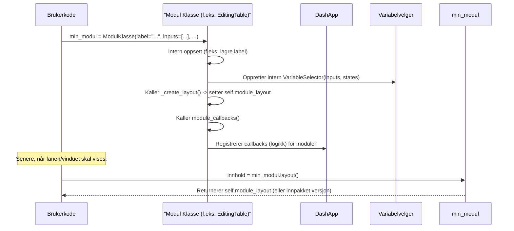

# Kapittel 4: Modul


I forrige kapittel, [Variabelvelger](03_variabelvelger_.md), lærte vi hvordan vi kan bruke Variabelvelgeren til å håndtere felles innstillinger og data som påvirker ulike deler av applikasjonen. Nå skal vi se nærmere på selve "byggeklossene" som bruker disse variablene og utgjør funksjonaliteten i applikasjonen din: **Moduler**.

## Hva er en Modul, og hvorfor trenger vi det?

Forestill deg at du bygger et avansert dashboard. Du vil kanskje ha:
*   En seksjon som viser data i en interaktiv tabell hvor brukeren kan redigere verdier.
*   En annen seksjon som lar brukeren skrive egne SQL-spørringer og se resultatene.
*   En tredje seksjon som viser en PDF-rapport basert på noen valgte kriterier.

Hvis du skulle skrive all koden for disse funksjonene i én stor fil, ville det fort blitt uoversiktlig og vanskelig å vedlikeholde. Det er her moduler kommer inn!

En **modul** i `ssb-dash-framework` er som en spesialisert Legokloss. Hver modul er en selvstendig enhet med en spesifikk jobb:
*   `EditingTable`-modulen er designet for å vise og redigere tabeller.
*   `FreeSearch`-modulen lar brukere kjøre SQL-spørringer.
*   `SkjemapdfViewer`-modulen er laget for å vise PDF-filer.

Hver slik "Legokloss" inneholder sin egen logikk for hvordan den fungerer (callbacks) og hvordan den ser ut (layout). Fordi de er selvstendige, kan du enkelt gjenbruke dem og kombinere dem for å bygge komplekse applikasjoner. Dette gjør koden din ryddigere, mer organisert og enklere å jobbe med.

## Nøkkelkonsepter: Byggeklossene i applikasjonen din

La oss se på de viktigste egenskapene til en modul:

1.  **Selvstendig Enhet:** En modul er en pakke med kode (vanligvis en Python-klasse) som håndterer en spesifikk del av applikasjonens funksjonalitet.
    *   **Analogi:** Tenk på en bil. Motoren er en modul, girkassen er en annen, og stereoanlegget er en tredje. Hver del har sin egen funksjon, men de jobber sammen.

2.  **Egen Logikk og Layout:**
    *   **Layout (`module_layout`):** Hver modul definerer sitt eget brukergrensesnitt – altså hvilke Dash-komponenter (knapper, tabeller, tekstfelt osv.) som skal vises. Dette lagres ofte i en egenskap kalt `module_layout`.
    *   **Logikk (`module_callbacks`):** Modulen definerer også sin egen oppførsel. Hva skjer når brukeren klikker på en knapp i modulen? Hvordan hentes data? Dette håndteres av Dash [callbacks](httpses://dash.plotly.com/basic-callbacks) som er spesifikke for modulen.

3.  **Konfigurerbar:** Du kan ofte tilpasse en modul når du tar den i bruk, for eksempel ved å fortelle den hvilke data den skal vise, eller hvordan den skal koble seg til [Variabelvelgeren](03_variabelvelger_.md).

4.  **Plassering:** Når du har en modul, kan du plassere den enten:
    *   I en **fane** for direkte tilgang (som vi så i [Faner og Vinduer (Modaler)](02_faner_og_vinduer__modaler__.md)).
    *   I et eget **vindu (modal)** som spretter opp (også dekket i [Faner og Vinduer (Modaler)](02_faner_og_vinduer__modaler__.md)).

`ssb-dash-framework` kommer med flere ferdiglagde moduler som du kan bruke direkte, som `EditingTable`, `FreeSearch`, og `SkjemapdfViewer`.

## Hvordan bruke en Modul (Eksempel: `EditingTable`)

La oss si at vi ønsker å legge til en redigerbar tabell i applikasjonen vår. Vi kan bruke den ferdiglagde modulen `EditingTable`.

**Steg 1: Importere og Forberede Nødvendigheter**

Først trenger vi å importere `EditingTable` og definere noen funksjoner som forteller modulen hvordan den skal hente og oppdatere data. Vi må også definere hvilke variabler fra [Variabelvelgeren](03_variabelvelger_.md) tabellen skal bruke.

```python
# Importer modulen og nødvendige hjelpemidler
from ssb_dash_framework.modules import EditingTable
from ssb_dash_framework.setup import VariableSelectorOption
import pandas as pd # For å lage eksempeldata

# Definer variabler som EditingTable skal bruke (fra Variabelvelger)
# Disse må være definert før du bruker dem i en modul
VariableSelectorOption(variable_title="valgt_tabell")
VariableSelectorOption(variable_title="filter_aar")

# Eksempel på funksjon som henter data (din logikk her)
def min_data_henter(tabell_navn: str, aar: str) -> pd.DataFrame:
    print(f"Henter data for {tabell_navn} for år {aar}")
    # I en ekte applikasjon ville du hentet data fra en database e.l.
    return pd.DataFrame({
        "id": [1, 2, 3],
        "navn": ["Ola", "Kari", "Per"],
        "verdi": [100, 150, 120]
    })

# Eksempel på funksjon som oppdaterer data (din logikk her)
def min_data_oppdaterer(tabell_navn: str, kolonne: str, ny_verdi: Any, rad_id: Any) -> None:
    print(f"Oppdaterer i {tabell_navn}: rad {rad_id}, kolonne {kolonne} til {ny_verdi}")
    # Logikk for å lagre endringen
```
Her lager vi dummy-funksjoner `min_data_henter` og `min_data_oppdaterer`. I en virkelig applikasjon ville disse koblet seg til datakilder. Vi definerer også "valgt_tabell" og "filter_aar" som variabler som [Variabelvelgeren](03_variabelvelger_.md) kan styre.

**Steg 2: Opprette en Instans av Modulen**

Nå kan vi lage en instans av `EditingTable`-modulen. Vi gir den et navn (label), forteller hvilke variabler fra [Variabelvelgeren](03_variabelvelger_.md) den skal bruke som `inputs` og `states`, og sender med funksjonene vi nettopp lagde.

```python
min_tabell_modul = EditingTable(
    label="Min Redigerbare Tabell",
    inputs=["valgt_tabell"], # Variabel som trigger datalasting
    states=["filter_aar"],   # Variabel som brukes som filter, men trigger ikke selv
    get_data_func=min_data_henter,
    update_table_func=min_data_oppdaterer
)
```
Når denne koden kjøres, blir `min_tabell_modul` et objekt som inneholder all logikken og layouten for en redigerbar tabell.
*   `label`: Dette er et internt navn for modulen.
*   `inputs`: En liste med navn på variabler fra [Variabelvelgeren](03_variabelvelger_.md). Når en av disse endres, vil `get_data_func` vanligvis bli kalt for å laste inn nye data i tabellen. Her vil endringer i "valgt_tabell" laste tabellen på nytt.
*   `states`: Også en liste med variabelnavn. Disse verdiene sendes med til `get_data_func`, men endringer i dem alene vil ikke automatisk laste tabellen på nytt. Her vil verdien av "filter_aar" bli sendt med når data hentes.
*   `get_data_func`: Funksjonen modulen skal bruke for å hente data.
*   `update_table_func`: Funksjonen modulen skal bruke når en bruker redigerer en celle i tabellen.

**Steg 3: Plassere Modulen i en Fane (eller Vindu)**

Nå som vi har `min_tabell_modul`, kan vi bruke den i en fane. Som vi lærte i kapittel [Faner og Vinduer (Modaler)](02_faner_og_vinduer__modaler__.md), trenger et fane-objekt en `label` og en `layout()`-metode. `ssb-dash-framework` har ofte ferdige "wrapper"-klasser for dette, som `EditingTableTab`.

```python
from ssb_dash_framework.tabs import EditingTableTab # Enkel måte å lage en fane

# EditingTableTab er en spesialisering som tar de samme argumentene som EditingTable
# og legger til funksjonalitet for å være en fane.
min_fane_med_tabell = EditingTableTab(
    label="Datatabell", # Navnet som vises på faneknappen
    inputs=["valgt_tabell"],
    states=["filter_aar"],
    get_data_func=min_data_henter,
    update_table_func=min_data_oppdaterer
)

# Nå kan min_fane_med_tabell legges til i tab_list i main_layout:
# app_layout_struktur = main_layout(
#     modal_list=[...],
#     tab_list=[min_fane_med_tabell, ...], # Her legges fanen inn
#     variable_list=["valgt_tabell", "filter_aar"]
# )
```
Her bruker vi `EditingTableTab`. Den tar de samme parameterne som `EditingTable` og sørger for at modulen fungerer korrekt som en fane. `min_fane_med_tabell.layout()` vil da returnere det brukergrensesnittet som `EditingTable`-modulen definerer (via sin `module_layout`). På samme måte finnes `EditingTableWindow` for å vise modulen i et vindu.

Resultatet er at du får en fane kalt "Datatabell" i applikasjonen din. Inne i denne fanen vil du se brukergrensesnittet til `EditingTable`-modulen (en tabell). Når du endrer "valgt_tabell" eller "filter_aar" i [Variabelvelgeren](03_variabelvelger_.md), vil `min_data_henter`-funksjonen bli kalt med de nye verdiene, og tabellen vil oppdateres.

## Under panseret: Hvordan er en Modul bygget opp?

Selv om du ofte vil bruke ferdige moduler, er det nyttig å forstå den generelle strukturen. De fleste moduler i `ssb-dash-framework` følger et lignende mønster:

1.  **Initialisering (`__init__`)**:
    *   Konstruktøren ( `__init__`-metoden) tar imot parametere for å konfigurere modulen (som `label`, `inputs`, `states`, datafunksjoner osv.).
    *   Den setter opp interne egenskaper, inkludert en [Variabelvelger](03_variabelvelger_.md)-instans hvis modulen skal interagere med globale variabler.
    *   Den kaller vanligvis en intern metode (f.eks. `_create_layout()`) for å bygge brukergrensesnittet, som lagres i en egenskap som `self.module_layout`.
    *   Til slutt kaller den en metode (f.eks. `self.module_callbacks()`) for å registrere all logikken (Dash callbacks) som modulen trenger.

2.  **Layout-generering (`_create_layout()` og `self.module_layout`)**:
    *   En intern metode som `_create_layout()` definerer Dash-komponentene som utgjør modulens brukergrensesnitt (f.eks. `dash_ag_grid.AgGrid`, `dbc.Input`, `html.Div`).
    *   Resultatet av `_create_layout()` lagres i `self.module_layout`.

3.  **Callback-registrering (`module_callbacks()`)**:
    *   Denne metoden inneholder definisjonene av alle Dash [callbacks](httpses://dash.plotly.com/basic-callbacks) som modulen bruker.
    *   Disse callbackene håndterer interaktivitet:
        *   Hvordan modulen reagerer på endringer i [Variabelvelgeren](03_variabelvelger_.md).
        *   Hva som skjer når brukeren interagerer med elementer i modulens layout (f.eks. redigerer en celle, klikker en knapp).
        *   Hvordan data hentes og vises.

4.  **Eksponering av layout (`layout()`)**:
    *   For at modulen skal kunne plasseres i en fane eller et vindu, trenger den en `layout()`-metode.
    *   For enkle moduler som skal vises i en fane, kan denne metoden rett og slett returnere `self.module_layout`.
    *   For moduler som skal vises i vinduer, eller som er mer komplekse, kan `layout()`-metoden gjøre mer (f.eks. bruke `WindowImplementation.layout(self)` som vi så i [Faner og Vinduer (Modaler)](02_faner_og_vinduer__modaler__.md)). Mange av de grunnleggende modulklassene (som `EditingTable`, `FreeSearch`) definerer `layout()` som en `abstractmethod`. Det betyr at en konkret klasse som arver fra dem (f.eks. `EditingTableTab` eller din egen spesialiserte modul) *må* implementere `layout()`-metoden for å spesifisere hvordan modulens `module_layout` skal presenteres.

Her er en forenklet flyt for hva som skjer når en modul initialiseres og brukes:



### Kode-dykk: `EditingTable` (forenklet)

La oss se på en forenklet versjon av hvordan `EditingTable` (fra `src/ssb_dash_framework/modules/tables.py`) er strukturert:

**1. Initialisering (`__init__`)**
```python
# src/ssb_dash_framework/modules/tables.py (sterkt forenklet)
class EditingTable(ABC): # ABC betyr Abstract Base Class
    def __init__(
        self,
        label: str,
        inputs: list[str],
        states: list[str],
        get_data_func: Callable[..., Any],
        update_table_func: Callable[..., Any],
        # ... andre parametere ...
    ) -> None:
        self.label = label
        # Oppretter VariableSelectorOption for alle inputs/states hvis de ikke finnes
        for var_navn in [*inputs, *states]:
            try:
                VariableSelectorOption(var_navn) # Definerer variabelen globalt
            except ValueError:
                pass # Eksisterer allerede, er OK

        # Intern VariableSelector for å håndtere interaksjon med globale variabler
        self.variableselector = VariableSelector(
            selected_inputs=inputs, selected_states=states
        )
        self.get_data = get_data_func
        self.update_table = update_table_func

        # Bygger layout og registrerer callbacks
        self.module_layout = self._create_layout() # Lager Dash-komponentene
        self.module_callbacks() # Setter opp logikken
```
Her ser vi at `__init__` lagrer de viktige funksjonene og listene med variabelnavn. Den lager en intern `VariableSelector` for å håndtere kommunikasjon med [Variabelvelgeren](03_variabelvelger_.md). Til slutt kalles `_create_layout()` og `module_callbacks()`.

**2. Layout-generering (`_create_layout`)**
```python
# src/ssb_dash_framework/modules/tables.py (sterkt forenklet)
# Inne i EditingTable-klassen:
    def _create_layout(self) -> html.Div:
        # Definerer hvordan modulen skal se ut
        layout = html.Div([
            dag.AgGrid( # En interaktiv tabellkomponent
                id=f"{self._editingtable_n}-tabelleditering-table1", # Unik ID
                defaultColDef={"editable": True}, # Gjør celler redigerbare
                # ... andre tabellinnstillinger ...
            ),
            html.P(id=f"{self._editingtable_n}-tabelleditering-status1") # For statusmeldinger
        ])
        return layout
```
`_create_layout()` returnerer en `html.Div` som inneholder en `dash_ag_grid.AgGrid`-komponent. Dette er selve tabellen brukeren vil se. Resultatet lagres i `self.module_layout`.

**3. Callback-registrering (`module_callbacks`)**
```python
# src/ssb_dash_framework/modules/tables.py (sterkt forenklet)
# Inne i EditingTable-klassen:
    def module_callbacks(self) -> None:
        # Henter Input- og State-objekter fra den interne VariableSelector
        dynamiske_inputs_og_states = [
            self.variableselector.get_inputs(), # f.eks. Input("var-valgt_tabell", "value")
            self.variableselector.get_states(),  # f.eks. State("var-filter_aar", "value")
        ]

        @callback( # Dash-decorator for å definere en callback
            Output(f"{self._editingtable_n}-tabelleditering-table1", "rowData"),
            Output(f"{self._editingtable_n}-tabelleditering-table1", "columnDefs"),
            *dynamiske_inputs_og_states, # Lytter på endringer i VariableSelector
        )
        def last_data_til_tabell(valgt_tabell_verdi, filter_aar_verdi, *args):
            # Kall self.get_data med verdiene fra VariableSelector
            df = self.get_data(valgt_tabell_verdi, filter_aar_verdi)
            # ... (forbered og returner data og kolonnedefinisjoner for AgGrid) ...
            return df_records, kolonner

        # ... Flere callbacks, f.eks. for å håndtere redigering (self.update_table) ...
```
`module_callbacks()` definerer logikken. Her ser vi en callback som lytter på endringer fra [Variabelvelgeren](03_variabelvelger_.md) (via `dynamiske_inputs_og_states`). Når en relevant variabel endres, kalles `last_data_til_tabell`-funksjonen, som igjen bruker `self.get_data` (som var `min_data_henter` i vårt eksempel) for å hente nye data og oppdatere tabellen.

**4. Abstrakt `layout()`-metode**
```python
# src/ssb_dash_framework/modules/tables.py
# Inne i EditingTable-klassen:
    @abstractmethod # Betyr at subklasser MÅ implementere denne
    def layout(self) -> html.Div:
        """Define the layout for the EditingTable module."""
        pass
```
Siden `EditingTable` er en abstrakt baseklasse, tvinger den subklasser (som `EditingTableTab` eller din egen spesialiserte klasse) til å definere en `layout()`-metode. Denne metoden vil typisk returnere `self.module_layout` (eventuelt innpakket for et vindu). For eksempel, i `EditingTableTab` ser `layout()`-metoden slik ut:
```python
# src/ssb_dash_framework/tabs/tables_tab.py
# Inne i EditingTableTab klassen:
    def layout(self) -> html.Div:
        """Generate the layout for the module as a tab."""
        layout = self.module_layout # Returnerer den interne layouten
        return layout
```
Dette viser hvordan den generelle modulen (`EditingTable`) sin `module_layout` blir tilgjengeliggjort for bruk i en fane.

## Oppsummering

I dette kapittelet har du lært:
*   At en **Modul** er en selvstendig, gjenbrukbar byggekloss med egen logikk og layout, som en spesialisert Legokloss.
*   At moduler hjelper deg å organisere koden din og bygge komplekse applikasjoner ved å kombinere mindre, funksjonsrike deler.
*   Hvordan du kan ta i bruk en ferdiglaget modul som `EditingTable` ved å:
    1.  Importere den.
    2.  Definere nødvendige datafunksjoner (`get_data_func`, `update_table_func`).
    3.  Opprette en instans av modulen og konfigurere den med `label`, `inputs` og `states` (for kobling til [Variabelvelgeren](03_variabelvelger_.md)), og datafunksjonene.
    4.  Bruke en wrapper-klasse (som `EditingTableTab`) eller din egen logikk for å plassere modulen i en [Fane og Vinduer (Modaler)](02_faner_og_vinduer__modaler__.md).
*   Den generelle interne strukturen til en modul: `__init__` for konfigurasjon, `_create_layout()` for å bygge UI (lagret i `self.module_layout`), og `module_callbacks()` for å definere logikken.

Med moduler har du et kraftig verktøy for å bygge robuste og vedlikeholdbare Dash-applikasjoner. Du kan enten bruke de mange ferdige modulene som følger med `ssb-dash-framework`, eller etter hvert lage dine egne!

I neste kapittel, [Altinn SkjemadatarEditor](05_altinn_skjemadatareditor_.md), skal vi se på en mer spesialisert modul som er designet for å jobbe med Altinn skjemadata.

---

Generated by [AI Codebase Knowledge Builder](https://github.com/The-Pocket/Tutorial-Codebase-Knowledge)
