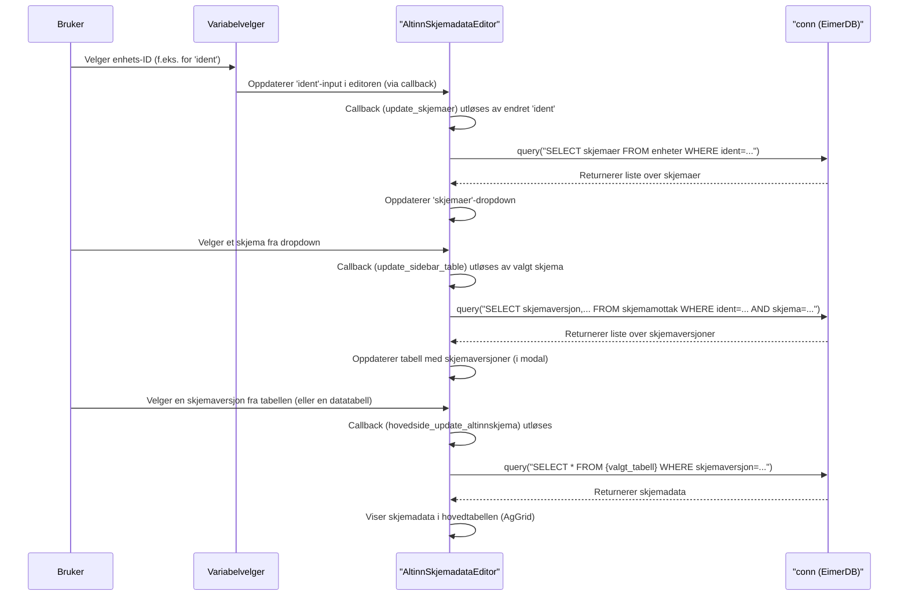

# Kapittel 5: Altinn SkjemadatarEditor


I forrige kapittel, [Modul](04_modul_.md), lærte vi hvordan moduler fungerer som gjenbrukbare byggeklosser med egen logikk og layout. Nå skal vi se på et konkret og avansert eksempel på en slik modul: `AltinnSkjemadataEditor`. Dette er en spesialisert modul designet for å jobbe med skjemadata, sannsynligvis fra Altinn-systemet.

## Hvorfor trenger vi en Altinn SkjemadatarEditor?

Forestill deg at du jobber med data som bedrifter har rapportert inn via Altinn-skjemaer. Disse skjemaene kan være komplekse og inneholde mange detaljer. Du trenger kanskje å:
*   Se nøyaktig hva en spesifikk bedrift (enhet) har rapportert.
*   Kunne redigere eller korrigere noen av disse dataene.
*   Sjekke historikk for endringer.
*   Se eventuelle automatiske kontroller som har slått ut på skjemaet.
*   Legge til kommentarer.

Å bygge et slikt system fra bunnen av for hvert nye Altinn-skjema ville vært en enorm jobb. `AltinnSkjemadataEditor` er designet for å gi deg en ferdig "digital arbeidsbenk" for akkurat slike oppgaver. Den gir et rikt brukergrensesnitt for å vise, redigere og administrere detaljerte skjemaer fra enheter.

## Nøkkelkonsepter: En avansert digital arbeidsbenk

`AltinnSkjemadataEditor` er et godt eksempel på hvordan rammeverkets grunnleggende byggeklosser ([Modul](04_modul_.md)er) kan settes sammen til en kompleks og funksjonsrik del av applikasjonen. Den bruker:
*   **`AltinnComponents`**: En baseklasse som definerer selve brukergrensesnittet (layouten) – alle knappene, tabellene, input-feltene og pop-up-vinduene.
*   **`AltinnSkjemadataEditor`**: Klassen som arver fra `AltinnComponents` og legger til all logikken (callbacks) som får arbeidsbenken til å fungere. Den håndterer datainnhenting, oppdateringer, og hvordan de ulike delene av brukergrensesnittet snakker sammen og med [Variabelvelgeren](03_variabelvelger_.md).

Tenk på det som en spesialisert fane i applikasjonen din, fullpakket med verktøy for å jobbe med skjemadata. Her er noen av funksjonene den inkluderer:
*   **Tabellvisning av skjemadata:** En sentral, redigerbar tabell (AG Grid) som viser selve skjemadataene.
*   **Informasjonskort for enheter:** Viser nøkkelinformasjon om den valgte enheten.
*   **Versjonskontroll av skjemaer:** Lar deg se og velge mellom ulike innsendte versjoner av et skjema.
*   **Pop-up-vinduer (modaler) og sidepaneler (offcanvas) for:**
    *   **Historikk:** Viser endringslogg for data.
    *   **Kommentarer:** Lar deg lese og legge til kommentarer knyttet til skjemaet.
    *   **Kontrollutslag:** Viser resultater fra automatiske datakontroller.
    *   **Kontaktinformasjon:** Viser kontaktinfo knyttet til skjemaet.
    *   **Hjelpetabeller:** Viser relaterte data eller beregninger.

## Hvordan bruke `AltinnSkjemadataEditor`

Siden `AltinnSkjemadataEditor` er en kompleks modul, er den ment å brukes som en helhetlig løsning for visning og redigering av Altinn-skjemadata. Du legger den vanligvis til som en fane i applikasjonen din.

**Steg 1: Importere og Forberede Nødvendigheter**

Først må du importere klassen og sørge for at nødvendige globale variabler er definert via [Variabelvelger](03_variabelvelger_.md) sin `VariableSelectorOption`. Editoren forventer visse variabler for å vite hvilken enhet, hvilket skjema, hvilken tabell osv. den skal jobbe med.

```python
# Importer modulen
from ssb_dash_framework.tabs import AltinnSkjemadataEditor
from ssb_dash_framework.setup import VariableSelectorOption
import pandas as pd # For å lage eksempeldata

# 1. Definer nødvendige globale variabler
VariableSelectorOption(variable_title="ident") # Enhetsidentifikator
VariableSelectorOption(variable_title="valgt_tabell") # Skjemadatatabell som vises
VariableSelectorOption(variable_title="statistikkvariabel") # Valgt variabel
VariableSelectorOption(variable_title="altinnskjema") # Valgt Altinn-skjema
VariableSelectorOption(variable_title="aar") # Eksempel på en tidsenhet
# ... andre variabler som din 'variable_connection' måtte trenge
VariableSelectorOption(variable_title="orgnr")
VariableSelectorOption(variable_title="navn")
```
Her definerer vi noen av de globale variablene som `AltinnSkjemadataEditor` vil lytte til eller oppdatere via [Variabelvelgeren](03_variabelvelger_.md).

**Steg 2: Forberede Datatilkobling og Konfigurasjon**

Modulen trenger en datatilkobling (`conn`) for å hente og lagre data (typisk et `eimerdb`-objekt). Den trenger også `time_units` (f.eks. `["aar", "kvartal"]`) som definerer tidsdimensjoner, og en `variable_connection` som kobler globale variabler til felt i enhetstabellen.

```python
# 2. Forbered tilkobling til datakilde (plassholder)
class DummyEimerDBConnection:
    def __init__(self):
        # For get_skjemadata_table_names
        self.tables = {"skjemadata_tabell1": {"schema": []}, "skjemadata_tabell2": {"schema": []}}

    def query(self, sql_query, partition_select=None):
        print(f"Kjører spørring: {sql_query} med partisjoner: {partition_select}")
        # Returner tomme dataframes for eksempelet, men med forventede kolonner
        if "enhetsinfo" in sql_query:
            return pd.DataFrame({"variabel": [], "verdi": []})
        if "enheter" in sql_query and "ident" in sql_query:
            return pd.DataFrame({"skjemaer": ["RA-0608"]})
        if "skjemamottak" in sql_query and "ident" in sql_query:
            return pd.DataFrame({"skjemaversjon": [], "dato_mottatt": [], "editert": [], "aktiv": []})
        if sql_query.startswith("SELECT t.*"): # Hoved skjemadata-tabell
             return pd.DataFrame({"variabel": [], "verdi": [], "row_id": [], "ident": []})
        # ... (andre forenklede returverdier for andre spørringer) ...
        return pd.DataFrame()

    def query_changes(self, sql_query, partition_select=None):
        print(f"Kjører historikkspørring: {sql_query} med partisjoner: {partition_select}")
        return pd.DataFrame({"change_id": [], "column_name": [], "old_value": [], "new_value": [], "datetime": []})

dummy_conn = DummyEimerDBConnection()

# 3. Definer 'time_units' og 'variable_connection'
mine_tidsenheter = ["aar"]
min_variabel_kobling = {
    "var-orgnr": "organisasjonsnummer", # Nøkkel: ID i Variabelvelger, Verdi: Kolonne i enhetsinfo
    "var-navn": "navn_enhet"
}
```
I en ekte applikasjon ville `dummy_conn` vært en faktisk tilkobling til din `eimerdb`-database. `min_variabel_kobling` forteller editoren hvordan den skal hente f.eks. organisasjonsnummer fra enhetstabellen og koble det til `var-orgnr` i [Variabelvelgeren](03_variabelvelger_.md).

**Steg 3: Opprette en Instans og Legge den til i Layouten**

Nå kan du opprette en instans av `AltinnSkjemadataEditor` og legge den til i listen over faner som sendes til `main_layout` (se [Applikasjonsoppsett og Hovedlayout](01_applikasjonsoppsett_og_hovedlayout_.md)).

```python
# 4. Opprett en instans av AltinnSkjemadataEditor
altinn_editor_fane = AltinnSkjemadataEditor(
    time_units=mine_tidsenheter,
    variable_connection=min_variabel_kobling,
    conn=dummy_conn
)

# 5. Legg den til i listen over faner for main_layout
# (anta at min_app er initialisert med app_setup)
# fane_liste = [altinn_editor_fane] # ... pluss eventuelle andre faner
#
# app_layout_struktur = main_layout(
#     modal_list=[], # Dine andre modaler her
#     tab_list=fane_liste,
#     variable_list=["ident", "valgt_tabell", "statistikkvariabel",
#                    "altinnskjema", "aar", "orgnr", "navn"] # Alle globale variabler
# )
# min_app.layout = app_layout_struktur
```
`AltinnSkjemadataEditor` er designet for å fungere direkte som en fane. Den arver `layout()`-metoden fra `AltinnComponents` og setter sin egen `label` (fanetittel). Når applikasjonen kjører, vil du ha en fane (merket "🗊 Altinn3-skjemadata") som inneholder hele redigeringsgrensesnittet.

Når brukeren velger en `ident` (enhets-ID) og en tidsenhet (f.eks. `aar`) i [Variabelvelgeren](03_variabelvelger_.md), vil `AltinnSkjemadataEditor` automatisk laste inn relevante skjemaer for den enheten, la brukeren velge et skjema og en tabell, og deretter vise dataene.

## Under panseret: Hvordan fungerer det?

`AltinnSkjemadataEditor` er en sammensatt modul. La oss se på hoveddelene:

1.  **Initialisering (`AltinnSkjemadataEditor.__init__`)**:
    *   Tar imot `time_units`, `variable_connection` og `conn`.
    *   Kaller `super().__init__(time_units)`, som er konstruktøren til `AltinnComponents`. Denne lagrer `time_units`.
    *   Setter `self.label` til "🗊 Altinn3-skjemadata". Dette blir navnet på fanen.
    *   Lagrer `variable_connection` og `conn`.
    *   Viktigst: Kaller `self.callbacks()`. Dette registrerer alle Dash-callbacks som håndterer interaktivitet og datal flyt.

2.  **Layout-generering (`AltinnComponents.layout()`)**:
    *   Denne metoden, som ligger i `AltinnComponents`-klassen, bygger hele brukergrensesnittet.
    *   Den returnerer en `html.Div` som er delt inn i et smalt sidepanel (ca. 10% bredde) og et stort hovedområde (ca. 90% bredde).
    *   **Sidepanelet** inneholder:
        *   Input-felt for hver `time_unit` (laget av `create_cards()`).
        *   Input-felt for `ident` (enhets-ID), en dropdown for `skjemaer` (tilgjengelige skjema for enheten), og et input-felt/knapp for `skjemaversjon`.
        *   Knapper for å åpne modaler som `enhetsinfomodal` (viser all enhetsinfo) og `skjemaversjonsmodal` (liste over alle skjemaversjoner).
        *   Et område (`skjemadata-sidebar-enhetsinfo`) som viser utvalgt enhetsinformasjon.
    *   **Hovedområdet** inneholder:
        *   En rad med knapper og dropdowns på toppen for å velge datatabell (`altinnedit-option1`), og for å åpne ulike funksjonsvinduer (kontaktinfo, hjelpetabeller, historikk, kontrollutslag, kommentarer).
        *   En stor `dash_ag_grid.AgGrid` (`altinnedit-table-skjemadata`) som viser selve skjemadataene.
    *   Metoden definerer også alle de ulike modal- og offcanvas-komponentene (f.eks. `historikkmodal`, `kontaktcanvas`). Disse er i utgangspunktet skjult og vises når tilhørende knapper klikkes.

3.  **Logikk (`AltinnSkjemadataEditor.callbacks()`)**:
    *   Dette er hjertet i modulen og inneholder en lang rekke Dash-callbacks. Disse styrer all dynamikk:
        *   **Synkronisering med [Variabelvelger](03_variabelvelger_.md):** Noen callbacks oppdaterer interne input-felt i editoren når verdier i [Variabelvelgeren](03_variabelvelger_.md) endres (f.eks. `ident`, `aar`). Andre callbacks oppdaterer [Variabelvelgeren](03_variabelvelger_.md) når brukeren gjør valg inne i editoren (f.eks. velger en tabell eller et spesifikt Altinn-skjema).
        *   **Datalasting:** Mange callbacks henter data fra databasen (`self.conn.query(...)`) basert på brukerens valg (enhet, skjema, versjon, tabell, tidsperioder). For eksempel lastes enhetsopplysninger, listen over skjemaer for en enhet, listen over mottatte skjemaversjoner, og selve skjemadataene dynamisk. Også data for kontrollutslag, historikk, kommentarer og kontaktinfo hentes på denne måten.
        *   **Brukerinteraksjon:** Callbacks håndterer klikk på knapper for å åpne/lukke alle modaler og offcanvas-paneler. De håndterer også valg i tabeller (f.eks. valg av en skjemaversjon).
        *   **Dataredigering:** Når en bruker endrer en verdi i hoveddatatabellen eller i tabellen med skjemaversjoner (f.eks. endrer "aktiv"-status), utløses en callback. Denne sjekker om kolonnen er redigerbar (via metadata fra `self.conn.tables`), og hvis ja, sendes en `UPDATE`-spørring til databasen via `self.conn.query()`. Endringer i kommentarfelt lagres også via callbacks.

Her er en veldig forenklet flyt for hvordan data lastes inn når en bruker velger en enhet:

Dette diagrammet viser bare en liten del av interaksjonene, men illustrerer hvordan valg fører til databasekall og oppdateringer i brukergrensesnittet.

### Kode-dykk: `AltinnComponents.layout()` (Forenklet)

Layout-metoden i `AltinnComponents` bygger strukturen. Her er et lite, konseptuelt utdrag:

```python
# src/ssb_dash_framework/tabs/altinn_components.py (konseptuelt utdrag)
# Inne i AltinnComponents-klassen:
    def layout(self) -> html.Div:
        # ... (skjemadata_table_names hentes via self.get_skjemadata_table_names()) ...
        layout_struktur = html.Div( # Hovedcontainer for hele fanen
            style={"display": "flex", "flexDirection": "row", ...}, # Side-ved-side layout
            children=[
                html.Div( # Sidepanel (venstre del, ca 10% bredde)
                    style={"width": "10%", "padding": "0.5rem"},
                    children=[
                        *self.create_cards(), # Dynamiske input-kort for tidsenheter
                        dbc.Input(id="altinnedit-ident", type="text"), # For enhets-ID
                        dcc.Dropdown(id="altinnedit-skjemaer"), # For valg av skjema
                        # ... flere knapper og input-felt for sidepanelet ...
                        self.offcanvas_kontrollutslag(), # Definerer et (skjult) offcanvas
                        self.historikkmodal(),         # Definerer en (skjult) modal
                        # ... definerer alle andre modaler og offcanvas-komponenter ...
                    ]
                ),
                html.Div( # Hovedinnhold (høyre del, ca 90% bredde)
                    style={"width": "90%", "padding": "1rem"},
                    children=[
                        # ... Rad med knapper/dropdowns for tabellvalg, kontaktinfo etc. ...
                        dcc.Dropdown(id="altinnedit-option1", ...), # Velg datatabell
                        # ...
                        dag.AgGrid(id="altinnedit-table-skjemadata", ...), # Hoveddatatabellen
                        html.P(id="skjemadata-hovedtabell-updatestatus"), # Statusmeldinger
                    ]
                )
            ]
        )
        return layout_struktur
```
Dette viser hvordan `layout()` setter opp en to-kolonne struktur og plasserer de ulike UI-elementene, inkludert definisjonene av modaler som i utgangspunktet er skjult. `self.create_cards()` lager f.eks. input-felt for hver tidsenhet (som "år", "kvartal") du har definert.

### Kode-dykk: `AltinnSkjemadataEditor.callbacks()` (Forenklet)

Callback-metoden i `AltinnSkjemadataEditor` inneholder logikken. Her er et eksempel på én callback (sterkt forenklet) som oppdaterer listen over tilgjengelige skjemaer når en bruker velger en enhet:

```python
# src/ssb_dash_framework/tabs/altinn_editor.py (konseptuelt utdrag)
# Inne i AltinnSkjemadataEditor-klassen:
    def callbacks(self) -> None:
        # ... (mange andre callbacks definert her) ...

        @callback(
            Output("altinnedit-skjemaer", "options"), # Hva som skal oppdateres: dropdown-valg
            Output("altinnedit-skjemaer", "value"),   # Og hva som er forhåndsvalgt
            Input("altinnedit-ident", "value"),     # Utløses når 'ident'-input endres
            *self.create_callback_components("Input"), # Henter også tidsenheter
        )
        def update_skjemaer(ident, *args_tidsenheter):
            if ident is None or any(arg is None for arg in args_tidsenheter):
                return [], None # Returner tomme lister hvis input mangler

            try:
                partisjons_args = dict(zip(self.time_units, args_tidsenheter, strict=False))
                # Hent data fra databasen via self.conn (datatilkoblingen)
                df_skjemaer = self.conn.query(
                    f"SELECT * FROM enheter WHERE ident = '{ident}'", # SQL-spørring
                    self.create_partition_select(skjema=None, **partisjons_args)
                )
                skjema_liste_tekst = df_skjemaer["skjemaer"][0] # Anta at det returnerer en kommaseparert streng
                # Gjør om strengen til en liste med dropdown-opsjoner
                skjemaer = [item.strip() for item in skjema_liste_tekst.split(",")]
                opsjoner = [{"label": item, "value": item} for item in skjemaer]
                verdi = opsjoner[0]["value"] if opsjoner else None # Velg første som standard
                return opsjoner, verdi
            except Exception as e:
                print(f"Feil under henting av skjemaer: {e}")
                return [], None # Returner tomt ved feil
        # ... (mange flere callbacks for all annen funksjonalitet) ...
```
Denne callbacken lytter etter endringer i `ident`-feltet (og tidsenhetene). Når `ident` endres, kjører den en spørring mot databasen for å finne hvilke skjemaer (`enheter`-tabellen) som er knyttet til den identen. Resultatet brukes til å oppdatere `options` (valgene) og `value` (det valgte elementet) i `altinnedit-skjemaer`-dropdownen. Dette er et typisk mønster i `AltinnSkjemadataEditor`: en brukerhandling fører til en callback, som henter data, som så oppdaterer et annet UI-element.

## Oppsummering

I dette kapittelet har vi sett på `AltinnSkjemadataEditor`, en kraftig og omfattende modul for å jobbe med Altinn-skjemadata. Du har lært:
*   At `AltinnSkjemadataEditor` fungerer som en avansert digital arbeidsbenk for å vise, redigere og administrere skjemadata.
*   At den er bygget opp av `AltinnComponents` (for brukergrensesnitt) og `AltinnSkjemadataEditor`-klassen (for logikk/callbacks).
*   Hvordan du tar den i bruk ved å opprette en instans med nødvendig konfigurasjon (`time_units`, `variable_connection`, `conn`) og legger den til som en fane i applikasjonen.
*   Litt om den interne strukturen: `AltinnComponents.layout()` bygger det komplekse brukergrensesnittet med sidepanel, hovedområde, tabeller og mange modaler/offcanvas-elementer. `AltinnSkjemadataEditor.callbacks()` registrerer en mengde Dash-callbacks som håndterer datal flyt, brukerinteraksjoner og kommunikasjon med [Variabelvelgeren](03_variabelvelger_.md) og databasen.

`AltinnSkjemadataEditor` er et godt eksempel på hvordan man kan bygge sofistikerte verktøy ved å kombinere de ulike delene av `ssb-dash-framework`.

I neste og siste kapittel, [Varslingshåndterer](06_varslingshåndterer_.md), skal vi se på hvordan rammeverket hjelper deg med å vise beskjeder, advarsler og feilmeldinger til brukeren på en ryddig måte.

---

Generated by [AI Codebase Knowledge Builder](https://github.com/The-Pocket/Tutorial-Codebase-Knowledge)
