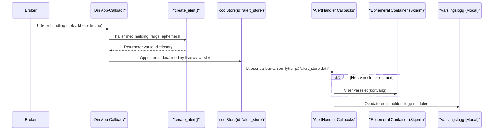

# Kapittel 6: Varslingshåndterer


I forrige kapittel, [Altinn SkjemadatarEditor](05_altinn_skjemadatareditor_.md), så vi på en spesialisert modul for å jobbe med komplekse skjemadata. Nå skal vi se på en annen viktig, men mer generell komponent som er en del av alle applikasjoner bygget med `ssb-dash-framework`: **Varslingshåndtereren**.

## Hvorfor trenger vi en Varslingshåndterer?

Forestill deg at du har bygget en flott applikasjon. Brukeren klikker på en knapp for å lagre data, laste opp en fil, eller utføre en beregning. Hvordan vet brukeren om handlingen var vellykket? Hva om noe gikk galt? Uten et system for tilbakemeldinger, kan brukeren bli usikker og frustrert.

**Varslingshåndtereren** fungerer som applikasjonens meldingssentral. Den tar imot og viser beskjeder til brukeren om viktige hendelser, feil, eller statusoppdateringer. Dette hjelper brukeren med å forstå hva som skjer i systemet og gir tilbakemelding på handlinger som utføres.

Tenk deg at du sender en pakke på posten. Du vil gjerne ha en melding når pakken er sendt, og en ny melding når den er levert. Hvis det er et problem med leveransen, vil du også vite det. Varslingshåndtereren gir applikasjonen din nettopp denne typen kommunikasjonsevne.

## Nøkkelkonsepter: Applikasjonens meldingssentral

La oss bryte ned de viktigste delene av Varslingshåndtereren:

1.  **Efemere varsler (midlertidige meldinger):**
    *   **Hva det er:** Korte, små meldinger som dukker opp på skjermen (vanligvis nederst til venstre) og forsvinner automatisk etter noen sekunder.
    *   **Analogi:** Som en "toast"-notifikasjon du ser på telefonen din når du får en ny e-post – den gir deg rask info og forsvinner.
    *   **Bruk:** Perfekt for å bekrefte en vellykket handling ("Data lagret!") eller gi en rask statusoppdatering.

2.  **Varslingslogg (Modalvindu):**
    *   **Hva det er:** Et eget vindu (en [Modal](02_faner_og_vinduer__modaler__.md)) som viser en komplett liste over alle varsler som har blitt generert i applikasjonen siden den startet.
    *   **Analogi:** Tenk på det som en loggbok eller en detaljert kvittering der du kan se historikken over alle meldinger.
    *   **Bruk:** Nyttig for å se detaljer om tidligere hendelser, spesielt feilmeldinger, eller hvis brukeren gikk glipp av et efemert varsel. Brukeren kan også filtrere varslene i loggen (f.eks. bare vise feil).

3.  **`create_alert()`-funksjonen:**
    *   **Hva det er:** En hjelpefunksjon for å lage standardiserte varselobjekter. Du gir den meldingsteksten, fargen (f.eks. "info", "warning", "danger"), og om varselet skal være efemert.
    *   **Analogi:** Som å fylle ut et standard postkort: du skriver meldingen, velger riktig frimerke (farge), og om det skal sendes som ekspress (efemert).
    *   **Bruk:** Sikrer at alle varsler har et konsistent format som Varslingshåndtereren forstår.

## Hvordan bruke Varslingshåndtereren

Varslingshåndtereren er automatisk inkludert og konfigurert når du bruker `main_layout` fra [Applikasjonsoppsett og Hovedlayout](01_applikasjonsoppsett_og_hovedlayout_.md). Du trenger bare å vite hvordan du sender meldinger til den.

**Steg 1: Sende et varsel fra en callback**

Den vanligste måten å vise et varsel på er å returnere et varselobjekt (laget med `create_alert()`) til en spesiell `dcc.Store`-komponent med ID-en `alert_store`. Denne `dcc.Store` er allerede satt opp for deg av `main_layout`.

La oss lage en enkel app med en knapp. Når knappen klikkes, skal vi vise et varsel.

```python
# Importer nødvendige funksjoner og komponenter
from dash import Dash, html, Input, Output, dcc, State
import dash_bootstrap_components as dbc
from ssb_dash_framework.setup import app_setup # For å sette opp appen
from ssb_dash_framework.setup import main_layout # For hovedlayout
from ssb_dash_framework.utils.alert_handler import create_alert # For å lage varsler

# Initialiser appen (som i kapittel 1)
min_app = app_setup(port=8051, service_prefix="/varsel-app/", stylesheet="sketchy")

# Lag en enkel fane med en knapp
class MinVarselFane:
    label = "Test Varsler"
    def layout(self):
        return html.Div([
            dbc.Button("Vis Info-varsel", id="info-knapp", color="info", className="m-2"),
            dbc.Button("Vis Feil-varsel", id="feil-knapp", color="danger", className="m-2"),
            dbc.Button("Vis Efemert varsel", id="efemert-knapp", color="success", className="m-2"),
        ])

# Sett opp main_layout (uten modaler eller variabler for dette eksempelet)
app_layout_struktur = main_layout(
    modal_list=[],
    tab_list=[MinVarselFane()],
    variable_list=[]
)
min_app.layout = app_layout_struktur

# Callback for å vise et standard info-varsel
@min_app.callback(
    Output("alert_store", "data", allow_duplicate=True), # Oppdaterer alert_store
    Input("info-knapp", "n_clicks"),
    State("alert_store", "data"), # Henter nåværende varsler
    prevent_initial_call=True
)
def vis_info_varsel(klikk, eksisterende_varsler):
    if klikk:
        nytt_varsel = create_alert("Dette er en informasjonsmelding!", color="info")
        return [nytt_varsel] + (eksisterende_varsler or []) # Legg til nytt varsel først
    return eksisterende_varsler

# Callback for å vise et feil-varsel
@min_app.callback(
    Output("alert_store", "data", allow_duplicate=True),
    Input("feil-knapp", "n_clicks"),
    State("alert_store", "data"),
    prevent_initial_call=True
)
def vis_feil_varsel(klikk, eksisterende_varsler):
    if klikk:
        nytt_varsel = create_alert("En feil har oppstått!", color="danger")
        return [nytt_varsel] + (eksisterende_varsler or [])
    return eksisterende_varsler

# Callback for å vise et efemert varsel
@min_app.callback(
    Output("alert_store", "data", allow_duplicate=True),
    Input("efemert-knapp", "n_clicks"),
    State("alert_store", "data"),
    prevent_initial_call=True
)
def vis_efemert_varsel(klikk, eksisterende_varsler):
    if klikk:
        nytt_varsel = create_alert(
            "Handling vellykket (forsvinner snart)!",
            color="success",
            ephemeral=True # Gjør varselet efemert
        )
        return [nytt_varsel] + (eksisterende_varsler or [])
    return eksisterende_varsler

# For å kjøre appen:
# if __name__ == "__main__":
#     min_app.run_server(debug=True)
```
I dette eksempelet:
*   Setter vi opp en enkel app med tre knapper i en fane.
*   Hver knapp har en callback som, når den klikkes:
    1.  Kaller `create_alert()` for å lage et varselobjekt.
        *   For "Info-knapp": `color="info"`.
        *   For "Feil-knapp": `color="danger"`.
        *   For "Efemert-knapp": `color="success"` og `ephemeral=True`.
    2.  Returnerer en *ny liste* med varsler til `Output("alert_store", "data")`. Det er viktig å legge det nye varselet til listen over eksisterende varsler (`[nytt_varsel] + (eksisterende_varsler or [])`).
*   `allow_duplicate=True` på `Output` er nødvendig fordi `alert_store` kan bli oppdatert av mange forskjellige callbacks i en større applikasjon.
*   `prevent_initial_call=True` forhindrer at callbacken kjører når appen starter.

**Hva skjer når du kjører appen og klikker på knappene?**
*   **"Vis Info-varsel"**: Ingenting synlig skjer umiddelbart på hovedskjermen, men varselet legges til i den interne `alert_store`. Du kan se det hvis du åpner varslingsloggen.
*   **"Vis Feil-varsel"**: Samme som info-varselet, det legges til i loggen.
*   **"Vis Efemert varsel"**: En grønn boks med meldingen "Handling vellykket (forsvinner snart)!" vil dukke opp nederst til venstre på skjermen og forsvinne etter ca. 4 sekunder. Dette varselet legges *også* til i loggen.

**Steg 2: Åpne Varslingsloggen**

I sidepanelet (som `main_layout` lager) vil du se en knapp med et "📜"-ikon (rulleblad/logg). Når du klikker på denne knappen, åpnes et modalvindu. Dette er varslingsloggen. Her vil du se alle varslene du har generert, inkludert de efemere.

Inne i varslingsloggen kan du:
*   Se en liste over alle varsler med tidsstempel, melding og farge.
*   Bruke filterknappene øverst ("Vis alle", "Vis kun info", "Vis kun advarsel", "Vis kun feil") for å filtrere listen.
*   Lukke individuelle varsler i loggen ved å klikke på krysset (x) på varselet.

## Under panseret: Hvordan fungerer det?

La oss se litt nærmere på hva som skjer bak kulissene.

### `AlertHandler`-klassen: Hjernen bak systemet

Klassen `AlertHandler` (fra `src/ssb_dash_framework/utils/alert_handler.py`) er ansvarlig for all varslingsfunksjonalitet.
Når `main_layout` initialiseres, oppretter den en instans av `AlertHandler`.

1.  **`AlertHandler.__init__()`**:
    *   Kaller `self.callbacks()` som registrerer alle Dash-callbacks som trengs for at varslingssystemet skal fungere.

2.  **`AlertHandler.layout()`**:
    *   Denne metoden definerer Dash-komponentene som utgjør varslingssystemet. Viktigst er:
        *   `dcc.Store(id="alert_store", data=[...])`: Her lagres listen over alle varselobjekter. Den initialiseres med et "Application started"-varsel.
        *   `dcc.Store(id="alert_filter", data="all")`: Lagrer gjeldende filterinnstilling for loggen.
        *   `html.Div(id="alert_ephemeral_container", ...)`: En fast container nederst til venstre på skjermen hvor efemere varsler vises.
        *   `dcc.Interval(id="alert_ephemeral_interval", ...)`: En timer som jevnlig sjekker om efemere varsler skal vises eller skjules.
        *   `dbc.Modal(id="alerts_modal", ...)`: Selve modalvinduet for varslingsloggen. Inneholder filterknapper og `html.Div(id="alert_modal_container")` hvor varslene listes opp.
        *   `sidebar_button("📜", "App logg", "sidebar-alerts-button")`: Knappen i sidepanelet for å åpne loggen.
    *   `main_layout` tar layouten returnert av `alerthandler.layout()` og legger den til i appens overordnede layout.

### `create_alert()`-funksjonen

Denne enkle funksjonen (også i `alert_handler.py`) lager bare en Python dictionary:
```python
# Fra src/ssb_dash_framework/utils/alert_handler.py
def create_alert(
    message: str, color: str | None = "info", ephemeral: bool | None = False
) -> dict[str, Any]:
    return {
        "timestamp": datetime.datetime.now().strftime("%Y-%m-%d %H:%M:%S"),
        "message": message,
        "color": color,
        "ephemeral": ephemeral,
        "created_at": time.time(), # For å spore synlighet av efemere varsler
    }
```
Den tar meldingen, fargen og om den er efemer som input, og returnerer en dictionary med disse verdiene pluss et tidsstempel og `created_at` (når varselet ble laget, brukt for å fjerne efemere varsler etter en viss tid).

### Flyten når et varsel genereres

Her er en forenklet sekvens av hva som skjer:


1.  Brukeren gjør noe som trigger en av dine app-callbacks.
2.  Din callback kaller `create_alert()` for å lage et varselobjekt.
3.  Din callback returnerer en oppdatert liste med varsler til `alert_store`.
4.  Endringen i `alert_store` trigger interne callbacks i `AlertHandler`:
    *   `display_ephemeral_alerts()`: Hvis det nye varselet har `ephemeral=True` og ikke er for gammelt (mindre enn 4 sekunder), vises det i `alert_ephemeral_container`. Denne callbacken kjøres jevnlig av `dcc.Interval`.
    *   `show_modal_alerts()`: Oppdaterer listen over varsler som vises i `alert_modal_container` (inne i logg-modalen), basert på gjeldende filter.

### Kode-dykk: Litt fra `alert_handler.py`

La oss se på et par sentrale deler:

**1. `AlertHandler.layout()` (forenklet utdrag som viser `alert_store` og modalen):**
```python
# src/ssb_dash_framework/utils/alert_handler.py (forenklet)
class AlertHandler:
    # ...
    def layout(self) -> html.Div:
        return html.Div([
            dcc.Store( # Lagrer alle varsler
                id="alert_store", data=[create_alert("Application started", "info")]
            ),
            # ... (store for filter, ephemeral container, interval) ...
            dbc.Modal( # Logg-vinduet
                [
                    dbc.ModalHeader(dbc.ModalTitle("Varsler")),
                    dbc.ModalBody([
                        # ... (Filterknapper) ...
                        html.Div(id="alert_modal_container"), # Her vises varslene
                    ]),
                ],
                id="alerts_modal", size="xl", # ...
            ),
            sidebar_button("📜", "App logg", "sidebar-alerts-button"), # Knapp for loggen
        ])
```
Her ser du hvordan `dcc.Store` med ID `alert_store` defineres, sammen med selve modalvinduet (`alerts_modal`) og knappen for å åpne det.

**2. Callback for å vise efemere varsler (`display_ephemeral_alerts`, forenklet):**
```python
# src/ssb_dash_framework/utils/alert_handler.py (forenklet)
# Inne i AlertHandler.callbacks():
        @callback(
            Output("alert_ephemeral_container", "children"),
            Input("alert_ephemeral_interval", "n_intervals"), # Kjøres jevnlig
            State("alert_store", "data"), # Henter alle varsler
        )
        def display_ephemeral_alerts(_: int, alerts: list[dict[str, Any]]):
            if not alerts: return []

            now = time.time()
            # Finn efemere varsler som er nyere enn 4 sekunder
            ephemeral_alerts_to_show = [
                a for a in alerts
                if a.get("ephemeral", False) and (now - a["created_at"] < 4)
            ]
            # Lag dbc.Alert komponenter for disse
            components = []
            for a in ephemeral_alerts_to_show:
                components.append(dbc.Alert(a["message"], color=a["color"]))
            return components
```
Denne callbacken kjøres hvert sekund (pga. `alert_ephemeral_interval`). Den sjekker `alert_store` for varsler som er merket som `ephemeral` og som ble laget for mindre enn 4 sekunder siden. For disse lages det `dbc.Alert`-komponenter som vises i `alert_ephemeral_container`.

### Hvordan `main_layout` inkluderer Varslingshåndtereren

I `src/ssb_dash_framework/setup/main_layout.py` ser du hvordan `AlertHandler` blir en del av appen:
```python
# src/ssb_dash_framework/setup/main_layout.py (utdrag)
from ..utils.alert_handler import AlertHandler # Importerer klassen

def main_layout(
    modal_list: list[html.Div],
    # ... andre parametere ...
) -> dbc.Container:
    # ... (oppretter VariableSelector) ...

    alerthandler = AlertHandler() # Oppretter en instans
    alerthandler_layout = alerthandler.layout() # Henter dens layout-komponenter
    # Legger varslingshåndtererens layout først i listen over modaler
    # (selv om det ikke er en tradisjonell modal som åpnes fra en knapp i modal_list,
    # plasseres dens UI-elementer (stores, logg-modal) i appens layout her)
    modal_list = [alerthandler_layout, *modal_list]

    # ... (bygger resten av layouten, inkludert sidepanelet hvor
    #      knappen for varslingsloggen ("sidebar-alerts-button") legges til) ...

    layout = dbc.Container( # Hovedcontainer
        [
            # ... (plass for efemere varsler er definert i alerthandler_layout) ...
            html.Div(id="main-layout", children=[
                html.Div(children=modal_list, className="bg-secondary"), # Sidepanel
                # ... (Hovedinnhold med faner etc.) ...
            ]),
        ],
        # ...
    )
    return layout
```
`main_layout` oppretter en `AlertHandler`-instans, henter dens layout (som inkluderer `dcc.Store` for varsler, selve logg-modalen, osv.), og fletter dette inn i den overordnede applikasjonslayouten. Knappen for å åpne loggen blir også lagt til i sidepanelet.

## Oppsummering

I dette kapittelet har du lært:
*   At **Varslingshåndtereren** er appens meldingssentral for å gi brukeren tilbakemelding.
*   Den har **efemere varsler** (midlertidige meldinger) og en **varslingslogg** (modalvindu med historikk).
*   Du bruker `create_alert()`-funksjonen for å lage standardiserte varselobjekter.
*   For å vise et varsel, returnerer du en liste med varselobjekter (laget med `create_alert()`) til `Output("alert_store", "data")` fra en av dine callbacks.
*   Varslingshåndtereren er automatisk satt opp av `main_layout`, så du kan fokusere på å *sende* varsler.
*   Litt om hvordan `AlertHandler`-klassen internt bruker `dcc.Store`, `dbc.Modal` og callbacks for å håndtere og vise varsler.

Med Varslingshåndtereren kan du enkelt og effektivt kommunisere med brukerne av din `ssb-dash-framework`-applikasjon, noe som gir en mye bedre brukeropplevelse.

Dette var det siste kapittelet i denne introduksjonsveiledningen til `ssb-dash-framework`. Vi håper du nå har fått en god forståelse av de grunnleggende konseptene og er klar til å begynne å bygge dine egne interaktive Dash-applikasjoner med rammeverket! Lykke til!

---

Generated by [AI Codebase Knowledge Builder](https://github.com/The-Pocket/Tutorial-Codebase-Knowledge)
