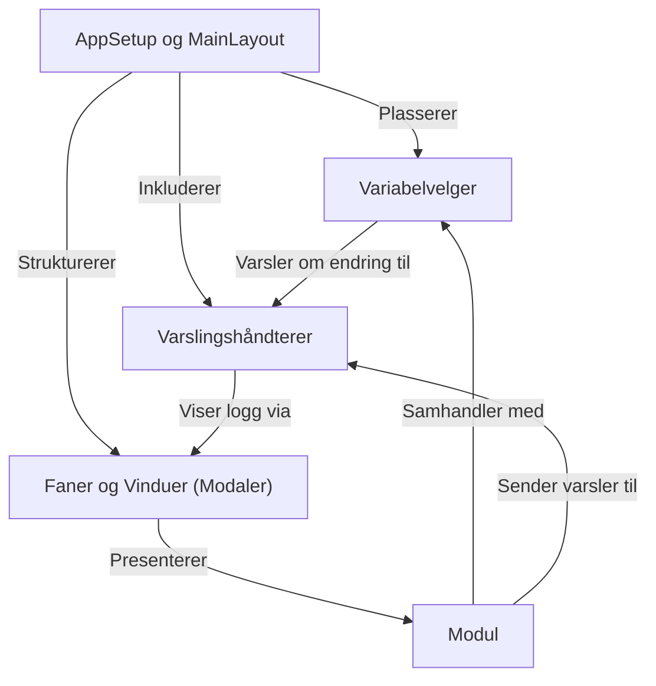

# Veileder for: ssb-dash-framework

`ssb-dash-framework` er et rammeverk for å bygge *interaktive webapplikasjoner* med Dash. Det lar utviklere enkelt sette sammen ulike **funksjonelle byggeklosser** (moduler) for å vise og behandle data. Rammeverket tilbyr en sentralisert måte å håndtere *felles dataverdier* (som årstall eller enhets-IDer) på tværs av applikasjonens deler. Det inkluderer også systemer for å *presentere moduler* i faner eller egne vinduer, samt et system for å *vise varsler* og meldinger til brukeren. Et eksempel på en avansert modul er en editor for *Altinn skjemadata*.

**Source Repository:** [ssb-dash-framework](https://github.com/statisticsnorway/ssb-dash-framework)

## Kapitler

1. [AppSetup og MainLayout
](01_applikasjonsoppsett_og_hovedlayout_.md)
2. [Faner og Vinduer (Modaler)
](02_faner_og_vinduer__modaler__.md)
3. [Variabelvelger
](03_variabelvelger_.md)
4. [Modul
](04_modul_.md)
5. [Altinn SkjemadatarEditor
](05_altinn_skjemadatareditor_.md)
6. [Varslingshåndterer
](06_varslingshåndterer_.md)

---

Generated by [AI Codebase Knowledge Builder](https://github.com/The-Pocket/Tutorial-Codebase-Knowledge)
