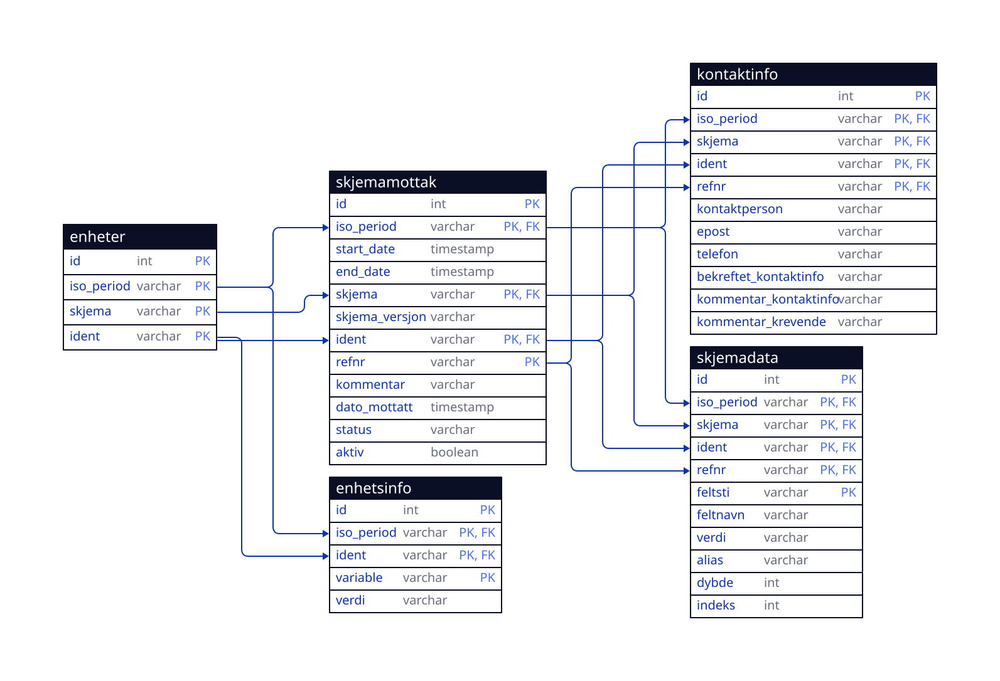

# Datamodels

Here you find documentation for each datamodel that ssb-dash-framework aims to support.

To create the svg file from the d2 file use:

    nix run nixpkgs#d2 -- --layout=elk -w altinn.d2 altinn_datamodel.svg

## Altinn data

This is the default datamodel generated from ssb-altinn-form-tools.

