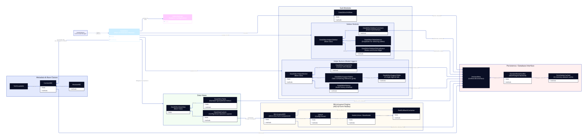

# DataEditor Module Documentation

The `DataEditor` module is a powerful, flexible, and fully configurable component within the **SSB Dash Framework**. It is designed specifically for micro-level editing, validation, and metadata visualization of statistical survey data (e.g., Altinn questionnaires) within Statistics Norway (SSB) platforms like Dapla.

This document serves as both a **Getting Started Guide** for new users and an **Advanced Architectural Blueprint** explaining how the module integrates within the broader framework.

---

## Table of Contents

1. [Getting Started for New Users](#1-getting-started-for-new-users)
   - [Overview & Use Case](#overview--use-case)
   - [Configuring with Python API](#configuring-with-python-api)
   - [Configuring with YAML](#configuring-with-yaml)
2. [MicroLayout Components Reference](#2-microlayout-components-reference)
   - [Layout & Grid Containers](#layout--grid-containers)
   - [Leaf & Value Fields](#leaf--value-components)
3. [Advanced Architecture & Framework Integration](#3-advanced-architecture--framework-integration)
   - [Structural Decomposition (InfoRow, Sidebar, Buttons, DataView)](#structural-decomposition)
   - [Decoupled Communication (VariableSelector Integration)](#decoupled-communication)
   - [The Data Access Layer (StandardDataHandler)](#the-data-access-layer)
   - [The MicroLayout Engine (Pydantic, AIO, Callbacks)](#the-microlayout-engine)
4. [Internal Architecture & UML Diagram](#4-internal-architecture--uml-diagram)

---

## 1. Getting Started for New Users

### Overview & Use Case

Statisticians at SSB frequently need to inspect and adjust individual survey responses (micro-level data editing) after they are captured. The `DataEditor` provides a customizable interface to achieve this. Rather than forcing developers to write redundant Dash callbacks, CSS rules, and database queries for each individual questionnaire form, the `DataEditor` abstracts this complexity behind a descriptive configuration format.

You can set up editing screens in two ways:
1. **Via Python API**: For programmatic, custom, or dynamic layouts.
2. **Via YAML Files**: For metadata-driven, fast, and easily maintainable layouts.

---

### Configuring with Python API

To instantiate a `DataEditor` using Python, you define its **Settings**, its **Data Handler**, and assemble the components for its sections (the Info Row, helper buttons, sidebars, and main data views).

Here is a typical Python implementation:

```python
import pandas as pd
from ssb_dash_framework import (
    DataEditor,
    EditorSettings,
    StandardDataHandler,
    VariableSelectorConfig,
    DataEditorHistory,
    DataEditorContactInfo,
    DataEditorSidebarEditingStatus,
    DataEditorSidebarComment,
    DataViewCustom
)
from ssb_dash_framework.setup.variableselector.time_unit import TimeUnit, TimeUnitType

# 1. Define global variable selector criteria
VariableSelectorConfig(
    refnr="refnr",
    ident="ident",
    time_units=TimeUnit(name="iso_period", frequency=TimeUnitType.MONTH),
    grouping_variables=["altinnskjema", "variabel"],
)

# 2. Set up editor database and column settings
settings = EditorSettings(
    starting_table="skjemadata",
    form_data_table="skjemadata",
    form_list=["RA-0187"],
    period_col="iso_period",
    ident_col="ident",
    refnr_col="refnr",
    form_name_col="skjema",
    field_name_col="feltsti",
    field_value_col="verdi",
)

# 3. Instantiate the standard data handler (communicates with the DB)
handler = StandardDataHandler()

# 4. Assemble the DataEditor Tab module
data_editor_tab = DataEditor(
    settings=settings,
    data_handler=handler,
    inforow={
        "orgnr": {"source": "variableselector", "variable_name": "ident"},
        "navn": {"source": "enhetsinfo", "variable_name": "navn"},
        "skjema": {"source": "variableselector", "variable_name": "altinnskjema"},
    },
    buttons=[
        DataEditorHistory(),
        DataEditorContactInfo(),
    ],
    sidebar=[
        DataEditorSidebarEditingStatus(),
        DataEditorSidebarComment(),
    ],
    dataview=[
        # A custom visual screen with defined containers and fields
        DataViewCustom(
            layout=[
                {
                    "type": "row",
                    "children": [
                        {
                            "type": "col",
                            "children": [
                                {
                                    "type": "microlayout",
                                    "label": "Internet Sales Form Section",
                                    "applies_to_table": "skjemadata",
                                    "applies_to_forms": ["RA-0187"],
                                    "layout": [
                                        {"type": "header", "label": "Internet Sales Summary", "size": "md"},
                                        {"type": "input", "label": "Revenue", "variable": "/omsVirksomhetPerioden"}
                                    ]
                                }
                            ]
                        }
                    ]
                }
            ],
        ),
    ],
)
```

---

### Configuring with YAML

With YAML-based app builds, you don't write setup code; instead, you define the application layout declaratively in a `.yaml` file. The framework automatically parses and validates this schema at runtime.

#### Application Configuration Example (`dataeditor_test.yaml`):

```yaml
app_settings:
  port: 8000
  enable_logging: false
  logging_level: warning
  variableselector:
    refnr: refnr
    ident: ident
    grouping_variables:
      - altinnskjema
      - variabel
    time_units:
        name: aar
        frequency: year
  connection:
    type: postgres
    database_url: test

modules:
  tabs:
    - type: DataEditor
      settings:
        starting_table: skjemadata
        form_data_table: skjemadata
        form_list:
          - RA-0187
        period_col: iso_period
        ident_col: ident
        refnr_col: refnr
        form_name_col: skjema
        field_name_col: feltsti
        field_value_col: verdi
      data_handler: StandardDataHandler
      inforow:
        orgnr: {"source": "variableselector", "variable_name": "ident"}
      buttons:
        - type: DataEditorHistory
        - type: DataEditorSupportTables
      sidebar:
        - type: DataEditorSidebarEditingStatus
        - type: DataEditorSidebarComment
      dataview:
        - type: DataViewCustom
          layout:
            - type: row
              children:
                - type: col
                  children:
                    - type: microlayout
                      label: Internett_salg
                      applies_to_table: skjemadata
                      applies_to_forms:
                        - RA-0187
                      field_name_col: "feltsti"
                      field_value_col: "verdi"
                      layout:
                        - type: header
                          label: Omsetning i Varehandelen
                          size: md
                        - type: row
                          children:
                            - type: col
                              children:
                                - type: input
                                  label: Omsetning i perioden (kr)
                                  id: omsVirksomhetPerioden
                                  variable: "/omsVirksomhetPerioden"
                                - type: input
                                  label: Omsetning forrige periode
                                  id: oms_fr
                                  variable: "/omsForrigePerPrefill"
                                - type: calculated-field
                                  label: Endring i Omsetning
                                  ids:
                                    oms: omsVirksomhetPerioden
                                    oms_fr: oms_fr
                                  expression: "Math.round(oms - oms_fr)"
                            - type: col
                              children:
                                - type: klass-dropdown
                                  klass_code: "689" # SSB Classification for "Årsak til null omsetning"
                                  label: Årsak til null omsetning
                                  variable: "/nullOmsPerAarsak"
                                  variable_trigger: "value"
                                - type: textarea
                                  label: Årsak kommentar
                                  variable: "/nullOmsPerAarsakSpes"
```

---

## 2. MicroLayout Components Reference

The key to customizing individual editing pages is `MicroLayout`. It arranges elements on a grid and binds input controls to data fields. In a `MicroLayout` definition, each item has a required `"type"` key.

Below is an overview of all supported components:

### Layout & Grid Containers

Container components arrange other elements into columns, rows, or tabular layouts. They contain a list of child configurations in their `children` key.

| Type | Key Properties | Description | Example |
| :--- | :--- | :--- | :--- |
| **`row`** | `children: list` | Arranges all child elements horizontally in a single row. | See YAML example above. |
| **`col`** | `children: list` | Arranges all child elements vertically in a column. | See YAML example above. |
| **`tabs`** | `children: list` | Displays a tabbed header bar. Children must be of type `tab`. | Useful for multi-page questionnaires. |
| **`tab`** | `label: str`, `children: list` | Represents a single page or view category inside a `tabs` group. | `{"type": "tab", "label": "Step 1", "children": [...]}` |

---

### Leaf & Value Components

Leaf components display static information, gather user input, show chart visualizers, or display auto-calculated numbers.

| Component Type | Properties | Description | Example Configuration |
| :--- | :--- | :--- | :--- |
| **`header`** | `label: str`<br>`size: Literal["sm", "md", "lg"]` | Displays a static title or section header. | `{"type": "header", "label": "Financials", "size": "md"}` |
| **`label`** | `label: str`<br>`hidelabel: bool` | Renders plain static helper text or instructions. | `{"type": "label", "label": "Please verify numbers against receipts."}` |
| **`input`** | `label: str`<br>`variable: str`<br>`id: str`<br>`readonly: bool` | Standard text box for reading and writing data values. Triggers a save on losing focus (`blur`). | `{"type": "input", "label": "Sales", "variable": "/sales_value"}` |
| **`textarea`**| `label: str`<br>`variable: str`<br>`readonly: bool` | Multiline input box. Best suited for comments, clarifications, or descriptive feedback. | `{"type": "textarea", "label": "Notes", "variable": "/notes_path"}` |
| **`dropdown`**| `label: str`<br>`variable: str`<br>`options: list[dict]`| Standard dropdown containing user-defined options of `{label, value}` objects. | `{"type": "dropdown", "label": "Type", "variable": "/sales_type", "options": [{"label": "Domestic", "value": "D"}]}` |
| **`checklist`**|`label: str`<br>`variable: str`<br>`options: list[dict]`| Checklist allowing users to toggle multiple criteria. | `{"type": "checklist", "label": "Tags", "variable": "/tags", "options": [{"label": "E-Commerce", "value": "eco"}]}` |
| **`klass-dropdown`**|`label: str`<br>`variable: str`<br>`klass_code: str`| **SSB-specific!** Connects directly with the **SSB Klass Classification API**. Fetches the classification code list (e.g. `689`) and translates them into dropdown options automatically. | `{"type": "klass-dropdown", "klass_code": "689", "label": "Reason Code", "variable": "/nullOmsAarsak"}` |
| **`klass-checklist`**|`label: str`<br>`variable: str`<br>`klass_code: str`| Similar to `klass-dropdown`, but renders the SSB Klass classifications as a checklist. | `{"type": "klass-checklist", "klass_code": "106", "label": "Industries", "variable": "/industry_codes"}` |
| **`calculated-field`**|`label: str`<br>`ids: dict`<br>`expression: str`| Runs client-side math calculations in real-time. Translates variable keys in `ids` to parameter inputs, and evaluates them with a standard JS `expression`. | `{"type": "calculated-field", "label": "Tax", "ids": {"val": "sales_input"}, "expression": "Math.round(val * 0.25)"}` |
| **`timeseries`**|`variable: list[str]`<br>`num_periods: int`<br>`label: str` | Renders a trend line (sparkline graph) of specific variable values over a past number of periods for historical comparison. | `{"type": "timeseries", "variable": ["/omsVirksomhetPerioden"], "num_periods": 12, "label": "Trend"}` |
| **`dynamic-list`**|`label: str`<br>`variable: str` | Generates lists of sub-items based on wildcards, capturing repeating or dynamic field lists. | `{"type": "dynamic-list", "label": "Sub-entities", "variable": "/sub_units/*"}` |

---

## 3. Advanced Architecture & Framework Integration

To understand how the `DataEditor` fits within the broader SSB Dash Framework, we need to inspect its internal division of responsibilities and flow.

```
+-----------------------------------------------------------------------+
|                       SSB Dash Application                            |
|                                                                       |
|   +---------------------------------------------------------------+   |
|   |                       VariableSelector                        |   |
|   |  - refnr (reference number)                                   |   |
|   |  - ident (organization identification)                        |   |
|   |  - altinnskjema (selected form)                               |   |
|   |  - iso_period (selected statistical period)                  |   |
|   +-----------------------------------------------+---------------+   |
|                                                   |                   |
|                                                   v triggers callbacks|
|   +---------------------------------------------------------------+   |
|   |                        DataEditor Tab                         |   |
|   |                                                               |   |
|   |  +---------------------------------------------------------+  |   |
|   |  |                        Info Row                         |  |   |
|   |  |  (Displays unit metadata: Orgnr, Name, active Form)     |  |   |
|   |  +---------------------------------------------------------+  |   |
|   |                                                               |   |
|   |  +------------+   +----------------------------------------+  |   |
|   |  |  Sidebar   |   |           Helper Buttons Row           |  |   |
|   |  | - Table    |   |  - Editing History   - Contact Info    |  |   |
|   |  |   Selector |   +----------------------------------------+  |   |
|   |  | - Status   |   +----------------------------------------+  |   |
|   |  |   Tracking |   |               Main View                |  |   |
|   |  | - Comments |   |   (Switches layouts dynamically based  |  |   |
|   |  +------------+   |    on selected Table and Form ID)      |  |   |
|   |                   |                                        |  |   |
|   |                   |    +------------------------------+    |  |   |
|   |                   |    |   DataViewCustom (Form)      |    |  |   |
|   |                   |    |   - Powered by MicroLayoutAIO|    |  |   |
|   |                   |    +------------------------------+    |  |   |
|   |                   +----------------------------------------+  |   |
|   +---------------------------------------+-----------------------+   |
|                                           |                           |
|                                           v reads/writes              |
|   +---------------------------------------+-----------------------+   |
|   |                      StandardDataHandler                      |   |
|   |   (Interacts with underlying Ibis/Postgres/Parquet backend)   |   |
|   +---------------------------------------------------------------+   |
+-----------------------------------------------------------------------+
```

---

### Structural Decomposition

An instantiated `DataEditor` is divided into four major UI panels:

1. **Info Row (`DataEditorInfoRow`)**:
   - Placed at the very top. It displays read-only identity indicators (e.g. enterprise name, organizational code, active form schema) relevant to the current respondent.
   - It queries these variables dynamically from auxiliary metadata tables like `enhetsinfo` depending on the current selections.

2. **Sidebar Modules (`DataEditorHelperSidebar`)**:
   - Placed in the left column.
   - **Table Selector**: A dropdown that lets the user choose which table to inspect/edit (e.g., `skjemadata`).
   - **Editing Status (`DataEditorSidebarEditingStatus`)**: Allows the statistician to mark a questionnaire as "Ubehandlet" (Unprocessed), "Under arbeid" (Under work/editing), or "Ferdig" (Finished/approved). Writes these flags directly back to the `skjemamottak` tracking table.
   - **Comment Field (`DataEditorSidebarComment`)**: Allows writing and retrieving notes or comments regarding that specific submission.

3. **Helper Buttons (`DataEditorHelperButton`)**:
   - Placed on the top-right card.
   - **History Viewer (`DataEditorHistory`)**: Provides an audit log showing previous field changes, values, and timestamps to track editing progress and rollback history.
   - **Contact Information (`DataEditorContactInfo`)**: Displays details of the person who submitted the form (e.g., name, phone number, email address) to enable easy verification and communication.

4. **Main Data View (`DataEditorDataView`)**:
   - Placed on the bottom-right card.
   - Depending on settings, it switches between a full-width spreadsheet editor (**`DataEditorTable`**) powered by AgGrid, or a customized, domain-specific questionnaire view (**`DataViewCustom`**) which parses your `microlayout` definitions.
   - If there are multiple layouts, it registers them under a layout lookup mapping index `(table_name, form_id)` and shows/hides them dynamically based on the current selection.

---

### Decoupled Communication

Modules in the SSB Dash Framework do not call each other directly. Instead, they rely on the **`VariableSelector`** to manage active contextual state (such as the selected company `ident`, statistical period `iso_period`, or active questionnaire identifier `altinnskjema`).

When a user switches units or periods in the global dropdowns:
1. The `VariableSelector` updates its global reactive attributes.
2. The `DataEditor` catches these changes through built-in Dash callbacks (e.g., `toggle_view_visibility` in `editor.py` listening to `VariableSelector.get_input("altinnskjema")`).
3. These callbacks fetch updated data from the backend, reset editing states, and re-render the appropriate custom micro-layouts for the matching questionnaire structure.

This decoupled architecture makes it extremely simple to plug different views or helper buttons in and out of the app without breaking core editor functionality.

---

### The Data Access Layer

To keep database queries separate from UI layout logic, the `DataEditor` depends on a data handler inheriting from **`FetcherMeta`**. The default implementation is **`StandardDataHandler`**.

The handler performs several tasks:
- **Form Caching**: Employs `FormGetterCached` to cache datasets from the backend on-the-fly, reducing database latency during navigation.
- **Reading Values (`get_field`)**: Queries targeted fields dynamically. For instance, filtering files/tables where the reference number (`refnr`) matches and where the field path (`feltsti`) matches the target variable path.
- **Committing Changes (`update_field`)**: Writes individual adjustments back to the database. Whenever a user types a new value and focus changes on an `input` or `textarea`, an update signal triggers the handler, which instantly updates the respective table (e.g., updating a cell's string value or setting updated statuses in the tracking database).

---

### The MicroLayout Engine

How does a JSON/YAML configuration list get translated into functional Dash components without developer intervention?

1. **Pydantic Validation**:
   When custom views are parsed (via `DataViewCustom.from_yaml` or when loading `AppConfig`), each element in the layout list is parsed against the discriminated union defined in `ssb_dash_framework/modules/data_editor/modules/microlayout/microlayout_components/models.py`.
   If a field is missing required parameters (such as a missing `klass_code` in `klass-dropdown`), the application fails fast during validation, printing precise errors before launching the web server.

2. **All-In-One (AIO) Isolation**:
   To prevent duplicate component ID conflicts when multiple micro-layouts are active simultaneously, the framework encapsulates forms inside the **`MicroLayoutAIO`** layout engine. Each form receives a randomized or structured UUID prefix (`aio_id`). Standard components inside utilize compound dictionary IDs:
   `id={"comp_id": field_variable, "aio": options.aio_id}`

3. **Auto-Wiring Callbacks**:
   Inside `MicroLayoutAIO`, the system loops through all validated leaf components. For every interactive node (like `InputField` or `Textarea`):
   - It instantiates a `FieldCallbackContainer` containing the specific field metadata.
   - It registers a dynamic Dash callback listening to changes (`n_blur` on inputs, or `value` changes on dropdowns).
   - When triggered, these callbacks feed changes directly into the `StandardDataHandler` which commits them, completing the end-to-end data flow seamlessly.

---

## 4. Internal Architecture & UML Diagram

To provide a complete map of how the classes, data wrappers, and dynamic layouts coordinate internally, we have authored a detailed **D2 UML Diagram** in [data_editor.d2](./data_editor.d2).

### Architectural Relationships Map

The D2 diagram outlines several critical layers:
1. **The Core Orchestration Module (`DataEditor`)**: Houses configurations, manages sub-layouts, and connects to the global `VariableSelector` to trigger updates on active context adjustments (such as switching target organizations or periods).
2. **Sub-Modules and Helper Panels**: Holds the layout and callback behavior for contextual widgets like metadata cards (`DataEditorInfoRow`), comments management (`DataEditorSidebarComment`), status toggles (`DataEditorSidebarEditingStatus`), and helper modals (`DataEditorContactInfo`, `DataEditorHistory`, `DataEditorSupportTables`).
3. **The Data Views Grid (`DataEditorTable` & `DataViewCustom`)**: Standard spreadsheet mode coordinates edits directly via SQL wrappers, while custom layouts read tree-like configurations to draw beautiful questionnaire interfaces.
4. **The MicroLayout Form Engine (`MicroLayoutAIO`)**: The heart of config-driven layouts. It validates shapes using Pydantic, generates isolated `aio_id` namespaces, auto-wires Javascript-based math callbacks, and dynamically binds blur-listeners.
5. **The Persistence/Database Access Layer (`StandardDataHandler`)**: Implements `FetcherMeta` to wrap all database execution. Integrates `FormGetterCached` to cache datasets on-the-fly and processes `UpdateSkjemadata` models.



### Rendering the UML Diagram

To compile this D2 specification into a visual SVG or PNG diagram, run:
```bash
d2 docs/modules/dataeditor/data_editor.d2 docs/modules/dataeditor/data_editor_uml.svg
```
Or you can paste the contents of `data_editor.d2` into any D2 playground/viewer (e.g., [https://play.d2lang.com/](https://play.d2lang.com/)).
