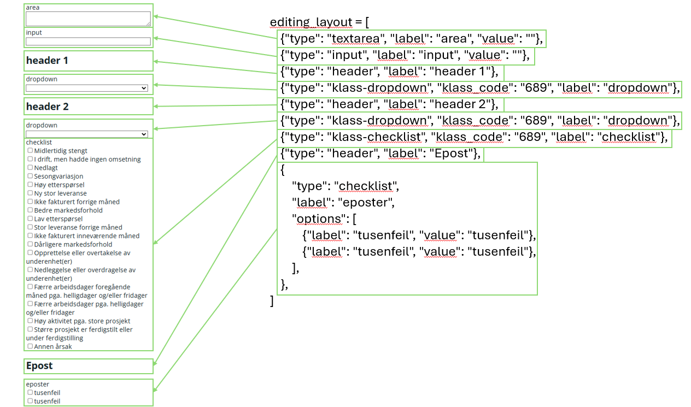

# MicroLayout
Modulen er under utvikling og det kan være funksjonalitet som ikke fungerer som tiltenkt.

## Innhold
- [Hva er MicroLayout-modulen og hva gjør den](#intro)
- [Bruk](#bruk)
    - [Mulige typer](#types)
    - [getter_func](#getter_func)
    - [update_func](#update_func)
    - [Avansert](#avansert)
- [Eksempel](#eksempel)
- [Internal](#internals)

## Hva er MicroLayout-modulen og hva gjør den?
<a id="intro"></a>
Modulen har som mål å gjøre det lettere å lage skjermbilder for editering på mikronivå. Den gjør dette ved å fjerne callbackhåndtering fra brukeren og håndtere layout og styling selv. Brukeren må angi et layout vha. kode, en funksjon for å hente data, og en funksjon for å oppdatere data. Funksjonssignaturene er basert på hvordan layoutet ser ut og hvilke states og input som er gitt til komponenten. Ønsker man at komponenten skal legge seg horisontalt kan man sette ``horizontal=True`` i ``MicroLayoutAIO``.
Eksempel på generert layout:


## Hvordan brukes den?
<a id="bruk"></a>
Modulen forventer å motta en liste med dictionaries som beskriver hvordan layouten skal være. Hver dictionary i layouten må ha en nøkkel som heter 'type' med verdi som tilhører listen under. Dette definerer hva slags komponent som skal vises.

### Mulige typer og påkrevde nøkler
<a id="types"></a>
- header
    - type
    - label
- textarea
    - type
    - label
    - value
- input
    - type
    - label
    - value
- checklist
    - type
    - label
    - options
        - label
        - value
- dropdown
- klass-dropdown
    - type
    - label
    - klass_code
- klass-checklist
    - type
    - label
    - klass_code

### getter_func
<a id="getter_func"></a>
Funksjonen skal brukes for å hente data til komponentene i layouten. Funksjonen forventer å motta alle inputene som er som er valgt fra variabelvelgeren, alle states som er oppgitt og eventuelle argumenter fra ```getter_args=[]```. Sistnevnte kan for eksempel være en databasetilkobling eller lignende. I eksempelet under er det bare gitt én input, getter_func forventer derfor bare ett argument.

```python
MicroLayoutAIO(
    layout=[
        {"type": "textarea", "label": "area", "value": ""},
    ],
    getter_func=lambda x: ("area",),
    update_func=lambda area: (),
    inputs=[Input("dropdown-id-2", "value")],
    states=[],
    getter_args=[]
),
```

### update_func
<a id="update_func"></a>
Funksjonen kjøres når brukeren oppdaterer dataen i layouten fra dashboardet. Funksjonen forventer å motta inputs fra ```layout```, ```inputs```, ```states``` og  ```getter_args``` i den rekkefølgen. Funksjonen trenger ikke å returnere noe da den ikke skal oppdatere noe på frontend-siden. ```getter_args``` kan for eksempel være en databasetilkobling eller lignende. I eksempelet under er det gitt én input, og to forskjellige layout-typer med input, update_func forventer derfor tre argumenter. OBS! Hvis man legger inn en overskrift med ```"type": "header"``` i layouten, så forventer ikke ```update_func``` å motta noe verdi fra denne da denne er statisk.

```python
MicroLayoutAIO(
    layout=[
        {"type": "textarea", "label": "area", "value": ""},
        {"type": "textarea", "label": "area_2", "value": ""}
    ],
    getter_func=lambda x: ("area", "area_2"),
    update_func=lambda area, area_2, dropdown_value: (),
    inputs=[Input("dropdown-id-2", "value")],
    states=[],
    getter_args=[]
),
```

### Avansert layout
<a id="avansert"></a>
Kompontenen lager alle elementene enten i en rad eller kolonne basert på ``horizontal=True`` eller ``horizontal=False`` i ``MicroLayoutAIO``. Ønsker man å ha flere av denne komponenten kan et tips være å pakke komponentene inn i en ```html.Div``` og bruke ```style={"display": "grid", "grid-template-columns": "50% 50%"}``` på ````html.Div``` for å plassere to komponenter ved siden av hverandre. Her kan man finne ytterligere dokumentasjon om ```grid``` [MDN](https://developer.mozilla.org/en-US/docs/Web/CSS/Reference/Properties/grid-template-columns).

## Eksempel
<a id="eksempel"></a>
```python
from ssb_dash_framework import MicroLayoutAIO

editing_layout = [
    {"type": "textarea", "label": "area", "value": ""},
    {"type": "input", "label": "input", "value": ""},
    {"type": "header", "label": "header 1"},
    {"type": "klass-dropdown", "klass_code": "689", "label": "dropdown"},
    {"type": "header", "label": "header 2"},
    {"type": "klass-dropdown", "klass_code": "689", "label": "dropdown"},
    {"type": "klass-checklist", "klass_code": "689", "label": "checklist"},
    {"type": "header", "label": "Epost"},
    {"type": "checklist", "label": "eposter", "options": [
            {"label": "tusenfeil", "value": "tusenfeil"},
            {"label": "epost", "value": "epost"}
        ]
    },
]

layout = html.Div(
    [
        dcc.Input(id="dropdown-id-1"),
        dcc.Input(id="dropdown-id-2"),
        MicroLayoutAIO(
            editing_layout,
            getter_func=lambda x: ("hei", "hei2", "01", "30", "20"),
            update_func=lambda x, y, z, k, j, f, l: (),
            inputs=[Input("dropdown-id-2", "value")],
            states=[],
            getter_args=[]
        ),
    ]
)

```
Eksempelet under genererer den følgende layouten:


## Hvordan fungerer den?
<a id="internals"></a>
Komponenten bruker layouten som er gitt for å generere opp en liste med html-elementer og callback-inputs for å lage visningen for brukeren. Senere bruker den callback-konteksten i dash for å finne ut om endringen er en oppdatering eller om man må hente ny data. Layouten valideres med en datamodell fra pydantic så appen vil ikke starte hvis brukeren lager en layout som ikke er gyldig.
